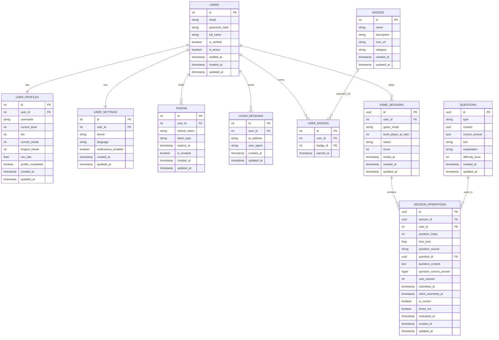

# MathBattle - Master Database Design

**Scope**: All platform features (Auth, User Profile, Badges, Game)  
**Tables**: 10 tables across 3 feature groups  
**Token Strategy**: Stateless JWT (7-day expiry) + refresh token stored in DB  
**Last Updated**: 2026-05-16

> **Note:** `app/models/auth.py` is intentionally empty — Token strategy is stateless JWT.  
> Token and LoginSession models live in `app/models/user.py` alongside other user-related tables.

---

## 📦 Feature Groups

| Group | Tables | Feature | Model File |
|-------|--------|---------|------------|
| **Auth** | users, user_profiles, user_settings, tokens, login_sessions | G01_F01 | `app/models/user.py` |
| **Profile & Badges** | user_profiles (shared), badges, user_badges | G01_F02 | `app/models/user.py`, `app/models/badge.py` |
| **Game** | questions, game_sessions, session_operations | G02_F04 | `app/models/question.py`, `app/models/game_session.py`, `app/models/session_operation.py` |

---

## 📊 Entity Relationship Diagram



---

## 🗄️ Table Definitions

### G01_F01 — Auth

#### USERS
```
id                   INT          PRIMARY KEY                    -- Unique user identifier
email                VARCHAR(255) UNIQUE NOT NULL               -- Login credential (stored lowercase)
password_hash        VARCHAR(255) NOT NULL                      -- Bcrypt hashed password (cost=12)
full_name            VARCHAR(100) NULL                          -- Display name (shown on profile)
is_verified          BOOLEAN      DEFAULT FALSE                 -- Email verified status
is_active            BOOLEAN      DEFAULT TRUE                  -- Account active status
account_locked_until TIMESTAMP    NULL                          -- Null = not locked
verified_at          TIMESTAMP    NULL                          -- Email verification timestamp
created_at           TIMESTAMP    DEFAULT NOW()                 -- Account creation timestamp
updated_at           TIMESTAMP    DEFAULT NOW()                 -- Last update timestamp
```

#### USER_SETTINGS
```
id                    INT         PRIMARY KEY                   -- Unique settings identifier
user_id               INT         UNIQUE FK → users.id          -- 1:1 with users
theme                 VARCHAR(20) DEFAULT 'auto'                -- 'auto' | 'light' | 'dark'
language              VARCHAR(10) DEFAULT 'en'                  -- 'en' | 'vi' | etc.
notifications_enabled BOOLEAN     DEFAULT TRUE                  -- Enable/disable notifications
created_at            TIMESTAMP   DEFAULT NOW()                 -- Settings creation timestamp
updated_at            TIMESTAMP   DEFAULT NOW()                 -- Last update timestamp
```

#### TOKENS
```
id            INT          PRIMARY KEY                          -- Unique token identifier
user_id       INT          FK → users.id                        -- Token owner
refresh_token VARCHAR(500) UNIQUE NOT NULL                      -- JWT refresh token string
token_type    VARCHAR(20)  DEFAULT 'refresh'                    -- Token type identifier
expires_at    TIMESTAMP    NOT NULL                             -- Expiry time (7 days)
is_revoked    BOOLEAN      DEFAULT FALSE                        -- Revocation flag
created_at    TIMESTAMP    DEFAULT NOW()
updated_at    TIMESTAMP    DEFAULT NOW()
```

#### LOGIN_SESSIONS
```
id         INT          PRIMARY KEY                             -- Unique session record
user_id    INT          FK → users.id                           -- Session owner
ip_address VARCHAR(45)  NOT NULL                               -- IPv4 (15) or IPv6 (39)
user_agent VARCHAR(500) NULL                                   -- Browser/client identifier
created_at TIMESTAMP    DEFAULT NOW()
updated_at TIMESTAMP    DEFAULT NOW()
```

---

### G01_F02 — User Profile & Badges

#### USER_PROFILES
```
id                INT         PRIMARY KEY                       -- Unique profile identifier
user_id           INT         UNIQUE FK → users.id             -- 1:1 with users
username          VARCHAR(30) UNIQUE NOT NULL                   -- Public game handle
current_level     INT         DEFAULT 1                        -- Current game level (1–100)
elo               INT         DEFAULT 1000                     -- Rating score (custom rules, up/down per game)
current_streak    INT         DEFAULT 0                        -- Consecutive daily active days
longest_streak    INT         DEFAULT 0                        -- All-time best streak
win_rate          FLOAT       DEFAULT 0.0                      -- Win ratio 0.0–1.0 (updated by game service)
profile_completed BOOLEAN     DEFAULT FALSE                    -- Onboarding completion flag
created_at        TIMESTAMP   DEFAULT NOW()
updated_at        TIMESTAMP   DEFAULT NOW()
```

> **Note:** `full_name` (display name) lives in `users` — no duplication in `user_profiles`.  
> **Note:** `elo` starts at 1000. The formula for increase/decrease is defined by game service business logic, not this schema.  
> **Note:** `win_rate` is a denormalized Float updated by the game service after each completed session. The game service queries `game_sessions` to recompute it when needed.

#### BADGES
```
id          INT          PRIMARY KEY                            -- Unique badge identifier
name        VARCHAR(100) UNIQUE NOT NULL                        -- Badge display name
description VARCHAR(500) NOT NULL                              -- What the badge represents
icon_url    VARCHAR(500) NOT NULL                              -- CDN URL for badge icon
category    VARCHAR(50)  DEFAULT 'general'                     -- 'streak' | 'game' | 'social' | 'general'
created_at  TIMESTAMP    DEFAULT NOW()
updated_at  TIMESTAMP    DEFAULT NOW()
```

**Initial seed data (5 badges):**

| name | description | category | trigger |
|------|-------------|----------|---------|
| First Victory | Win your first game session | game | First completed game |
| Hot Streak | Maintain a 7-day daily streak | streak | current_streak ≥ 7 |
| Century Club | Accumulate 1,000 Elo | game | elo ≥ 1000 (after progression) |
| Speed Demon | Answer 10 questions under 3 seconds each | game | In-game evaluation |
| Level 10 | Reach level 10 | game | current_level ≥ 10 |

#### USER_BADGES
```
id        INT       PRIMARY KEY                                 -- Unique record
user_id   INT       FK → users.id NOT NULL                      -- Badge recipient
badge_id  INT       FK → badges.id NOT NULL                     -- Badge earned
earned_at TIMESTAMP DEFAULT NOW()                              -- When the badge was awarded
-- UNIQUE(user_id, badge_id) — each badge awarded once per user
```

---

### G02_F04 — Game

#### QUESTIONS
```
id               UUID      PRIMARY KEY DEFAULT gen_random_uuid()   -- Unique question identifier
type             VARCHAR(20) NOT NULL                              -- 'math' | 'sequence' | 'mcq' | ...
content          JSON      NOT NULL                                -- Question data (expression, choices, etc.)
correct_answer   JSON      NOT NULL                                -- Expected answer (supports complex types)
hint             VARCHAR(255) NULL                                 -- Optional hint shown to player
explanation      VARCHAR(255) NULL                                 -- Post-answer explanation
difficulty_level INT       NULL                                    -- 1 = easy … N = hard (null = unrated)
created_at       TIMESTAMP DEFAULT NOW()
updated_at       TIMESTAMP DEFAULT NOW()
```

> **Note:** `content` and `correct_answer` are JSON to support different question types (e.g., math expression string, MCQ option list, sequence array).

#### GAME_SESSIONS
```
id                   UUID      PRIMARY KEY DEFAULT gen_random_uuid()  -- Session identifier
user_id              INT       FK → users.id NOT NULL                  -- Session owner
game_mode            VARCHAR   NOT NULL                                -- 'daily_challenge' | 'level_up' | 'mini_game' | 'quick_calculate'
level_player_at_start INT      NOT NULL DEFAULT 1                      -- Player level when session started
status               VARCHAR(20) NOT NULL DEFAULT 'active'            -- 'active' | 'completed' | 'timed_out'
score                INT       NULL                                    -- Final score (set on completion)
ended_at             TIMESTAMP NULL                                    -- Session end time
created_at           TIMESTAMP DEFAULT NOW()
updated_at           TIMESTAMP DEFAULT NOW()
```

#### SESSION_OPERATIONS
```
id                      UUID      PRIMARY KEY DEFAULT gen_random_uuid()
session_id              UUID      FK → game_sessions.id NOT NULL
user_id                 INT       FK → users.id NOT NULL
question_index          INT       NOT NULL                             -- 0-based position in session
time_limit              FLOAT     NOT NULL                             -- Seconds allowed for this question
question_source         VARCHAR(50) NOT NULL DEFAULT 'bank'           -- 'bank' | 'generated'
question_id             UUID      FK → questions.id NULL              -- Set when source='bank'
question_content        TEXT      NULL                                -- Set when source='generated'
question_correct_answer BIGINT    NULL                                -- Set when source='generated'
user_answer             INT       NULL                                -- Player's submitted answer
submitted_at            TIMESTAMP NULL                                -- Server receive time
client_submitted_at     TIMESTAMP NULL                                -- Client-reported submit time
is_correct              BOOLEAN   NULL                                -- Null until evaluated
timed_out               BOOLEAN   NOT NULL DEFAULT FALSE
evaluated_at            TIMESTAMP NULL
created_at              TIMESTAMP DEFAULT NOW()
updated_at              TIMESTAMP DEFAULT NOW()
```

---

## 🔑 Indexes

```sql
-- USERS
CREATE UNIQUE INDEX idx_users_email        ON users(LOWER(email));
CREATE INDEX idx_users_verified_active     ON users(is_verified, is_active);

-- USER_PROFILES
CREATE UNIQUE INDEX idx_user_profiles_user_id  ON user_profiles(user_id);
CREATE UNIQUE INDEX idx_user_profiles_username ON user_profiles(LOWER(username));
CREATE INDEX idx_user_profiles_elo             ON user_profiles(elo DESC);  -- rank queries

-- USER_SETTINGS
CREATE UNIQUE INDEX idx_user_settings_user_id ON user_settings(user_id);

-- TOKENS
CREATE UNIQUE INDEX idx_tokens_refresh_token  ON tokens(refresh_token);
CREATE INDEX idx_tokens_user_active           ON tokens(user_id, is_revoked);
CREATE INDEX idx_tokens_expires_at            ON tokens(expires_at);

-- LOGIN_SESSIONS
CREATE INDEX idx_login_sessions_user_time ON login_sessions(user_id, created_at);

-- BADGES
CREATE UNIQUE INDEX idx_badges_name ON badges(name);

-- USER_BADGES
CREATE UNIQUE INDEX idx_user_badges_user_badge ON user_badges(user_id, badge_id);
CREATE INDEX idx_user_badges_user_id           ON user_badges(user_id);

-- QUESTIONS
CREATE INDEX idx_questions_type             ON questions(type);
CREATE INDEX idx_questions_difficulty_level ON questions(difficulty_level);

-- GAME_SESSIONS
CREATE INDEX idx_game_sessions_user_status ON game_sessions(user_id, status);

-- SESSION_OPERATIONS
CREATE INDEX idx_session_ops_session_idx ON session_operations(session_id, question_index);
CREATE INDEX idx_session_ops_question_id ON session_operations(question_id);
```
