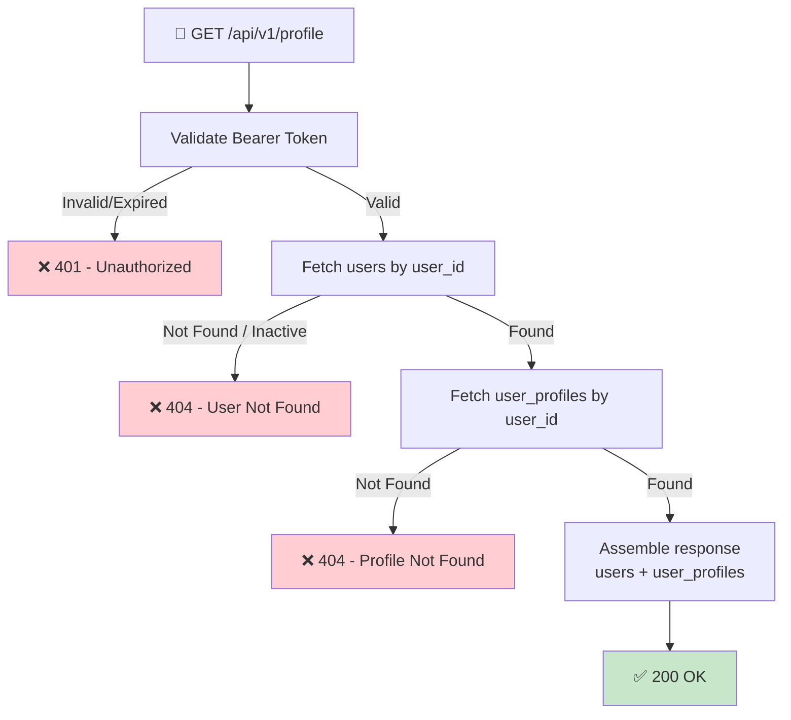

## 📝 Change History
| Date | Version | Changes | Status |
|------|---------|---------|--------|
| 2026-05-16 | 1.1.0 | Removed avatar/frame/premium (not in scope); full_name from users table serves as display name; aligned with final DB schema | 📝 Draft |
| 2026-05-15 | 1.0.0 | Initial creation | 📝 Draft |

# G01_F02_SF01: View Basic Profile Info

📝 Draft  
**Function**: User Profile (G01_F02)  
**Status**: ⬜ NOT STARTED  
**Priority**: Medium (Phase 2)  
**Difficulty**: Easy  

---

## 📋 Description

Return the authenticated user's basic profile information: username, display name (full_name), current level, and join date. This is the identity card displayed across the platform (profile page, leaderboard, game lobby).

---

## 🎯 Detailed Requirements

### Input Parameters

**Request Headers**
```
Authorization: Bearer <access_token>
```

No request body required.

### Output Schemas

**Success Response (200 OK)**
```json
{
  "success": true,
  "data": {
    "user_id": 1,
    "username": "user_1",
    "full_name": "John Doe",
    "current_level": 5,
    "join_date": "2026-05-01T08:00:00Z"
  },
  "error": null
}
```

> **Note:** `full_name` is nullable — users who registered without a name will get `null`.  
> `username` is auto-generated at registration as `user_{id}` and can be changed later.

**Error Responses**

Error codes: `UNAUTHORIZED` (401), `USER_NOT_FOUND` (404), `PROFILE_NOT_FOUND` (404)

```json
{
  "success": false,
  "data": null,
  "error": { "code": "UNAUTHORIZED", "message": "Authentication required" }
}
```

---

## 🗏️ Business Logic (5 Steps)

1. **Authenticate Request** — Validate Bearer token via `get_current_user_id()` dependency → Return 401 if invalid or expired
2. **Fetch User Record** — Query `users` by `user_id` → Return 404 if not found or `is_active=false`
3. **Fetch User Profile** — Query `user_profiles` by `user_id` → Return 404 if missing
4. **Assemble Response** — Combine `users.full_name`, `users.created_at` (join_date) with `user_profiles.username`, `user_profiles.current_level`
5. **Return 200** — Serialize and return

---

## 🔄 Flow Diagram



---

## 💻 Backend Implementation

**Status**: ⬜ NOT STARTED  
**Location**: `app/schemas/profile.py`, `app/services/profile_service.py`, `app/api/v1/profile.py`  
**Tests**: `tests/test_profile.py`

### Architecture Overview

| Component | Purpose | Details |
|-----------|---------|---------|
| **Pydantic Schema** | Response serialization | `BasicProfileResponse` — user_id, username, full_name, current_level, join_date |
| **Service Layer** | DB queries | Join `users` + `user_profiles` by user_id |
| **API Router** | HTTP endpoint | GET `/api/v1/profile` — requires auth dependency |
| **Auth Dependency** | Token validation | `get_current_user_id()` from `app/api/deps.py` |

### Database Fields Used

| Field | Source Table | Column |
|-------|-------------|--------|
| `user_id` | `users` | `id` |
| `full_name` | `users` | `full_name` (nullable) |
| `join_date` | `users` | `created_at` |
| `username` | `user_profiles` | `username` |
| `current_level` | `user_profiles` | `current_level` |

> No new columns needed — all fields already exist in the current schema.

### Implementation Highlights

⬜ **Schema**: `BasicProfileResponse` Pydantic model  
⬜ **Service**: `get_basic_profile(user_id)` — async join query  
⬜ **Router**: `GET /api/v1/profile` registered in `app/main.py`  
⬜ **Tests**: Happy path + 401/404 cases  

### Future Enhancements

- Public profile: `GET /api/v1/users/{username}/profile`
- Avatar upload and frame selection
- Premium tier badge

---

## 📊 Security Considerations

| Area | Implementation |
|------|----------------|
| **Authentication** | Bearer token required; `get_current_user_id()` validates and extracts user_id |
| **Authorization** | Users can only view their own profile via this endpoint |
| **Data Exposure** | Email and password_hash are never returned |
| **Inactive Accounts** | `is_active=false` → 404 to avoid enumeration |

---

## ✅ Test Coverage

### Planned Tests

- ⬜ `test_get_profile_success` — authenticated user receives full profile
- ⬜ `test_get_profile_unauthenticated` — missing token → 401
- ⬜ `test_get_profile_expired_token` — expired token → 401
- ⬜ `test_get_profile_null_full_name` — user without full_name returns null
- ⬜ `test_get_profile_inactive_user` — inactive user → 404

---

## 🚀 API Endpoint

**GET** `/api/v1/profile`

```
Authorization: Bearer <access_token>
```

✅ **Success (200)**
```json
{
  "success": true,
  "data": {
    "user_id": 1,
    "username": "user_1",
    "full_name": "John Doe",
    "current_level": 5,
    "join_date": "2026-05-01T08:00:00Z"
  },
  "error": null
}
```

---

## 📋 Implementation Checklist

- [ ] Define `BasicProfileResponse` Pydantic schema in `app/schemas/profile.py`
- [ ] Implement `get_basic_profile()` in `app/services/profile_service.py`
- [ ] Create `GET /api/v1/profile` route in `app/api/v1/profile.py`
- [ ] Register profile router in `app/main.py`
- [ ] Write tests and confirm all pass

---

## 🔗 Related Documentation

- **Database Models**: `app/models/user.py`
- **Auth Dependency**: `app/api/deps.py`
- **Service Logic**: `app/services/profile_service.py`
- **API Router**: `app/api/v1/profile.py`
- **Test Suite**: `tests/test_profile.py`
- **Related Specs**: G01_F02_SF02, G01_F02_SF03

---

**Last Updated**: 2026-05-16  
**Implementation Status**: ⬜ NOT STARTED  
**Test Status**: ⬜ NOT STARTED
