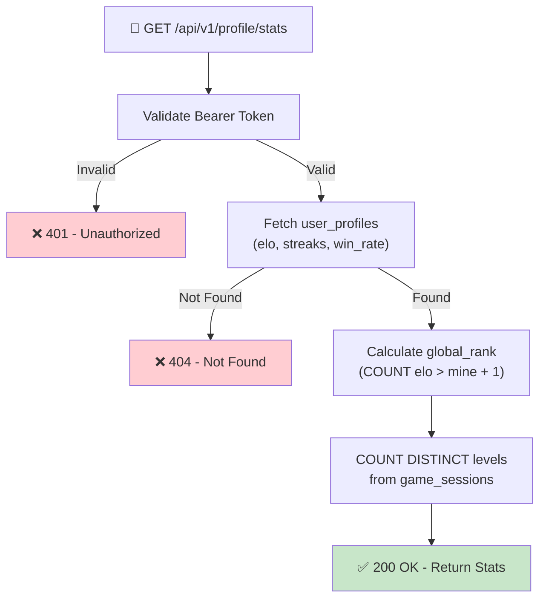

## 📝 Change History
| Date | Version | Changes | Status |
|------|---------|---------|--------|
| 2026-05-16 | 1.1.0 | Renamed total_exp → elo; win_rate moved to user_profiles (denormalized); removed games_played/games_won from response; aligned with final DB schema | 📝 Draft |
| 2026-05-15 | 1.0.0 | Initial creation | 📝 Draft |

# G01_F02_SF02: View Personal Statistics

📝 Draft  
**Function**: User Profile (G01_F02)  
**Status**: ⬜ NOT STARTED  
**Priority**: Medium (Phase 2)  
**Difficulty**: Medium  

---

## 📋 Description

Return the authenticated user's performance statistics: Elo rating, current daily streak, longest streak, win rate, global rank, and levels completed. This data appears on the profile statistics tab and the leaderboard widget.

---

## 🎯 Detailed Requirements

### Input Parameters

**Request Headers**
```
Authorization: Bearer <access_token>
```

No request body required.

### Output Schemas

**Success Response (200 OK)**
```json
{
  "success": true,
  "data": {
    "elo": 1250,
    "current_streak": 5,
    "longest_streak": 12,
    "win_rate": 0.65,
    "global_rank": 42,
    "levels_completed": 8
  },
  "error": null
}
```

> `win_rate` is stored as Float 0.0–1.0 in `user_profiles` and updated by the game service after each session.  
> `global_rank` and `levels_completed` are computed at query time from `user_profiles` and `game_sessions`.

**Error Responses**

Error codes: `UNAUTHORIZED` (401), `USER_NOT_FOUND` (404)

```json
{
  "success": false,
  "data": null,
  "error": { "code": "UNAUTHORIZED", "message": "Authentication required" }
}
```

---

## 🗏️ Business Logic (5 Steps)

1. **Authenticate Request** — Validate Bearer token via `get_current_user_id()` → Return 401 if invalid
2. **Fetch Profile Stats** — Read `user_profiles` for `elo`, `current_streak`, `longest_streak`, `win_rate`; return 404 if missing
3. **Calculate Global Rank** — `COUNT(user_profiles WHERE elo > current_elo) + 1`; tie-break by `created_at ASC` (earlier registration = higher rank)
4. **Count Levels Completed** — `COUNT(DISTINCT level_player_at_start) FROM game_sessions WHERE user_id = :uid AND status = 'completed'`
5. **Return 200** — Assemble and return all stats

### Streak Logic (maintained by game service, not this endpoint)

- Streak increments when the user completes at least one game session on a calendar day (UTC)
- Streak breaks when there is a gap of 2+ calendar days
- `longest_streak` is updated by the game service whenever `current_streak` exceeds it
- This endpoint only **reads** the stored values — it does not recalculate

### Rank Calculation

```sql
SELECT COUNT(*) + 1 AS rank
FROM user_profiles
WHERE elo > (SELECT elo FROM user_profiles WHERE user_id = :uid)
```

---

## 🔄 Flow Diagram



---

## 💻 Backend Implementation

**Status**: ⬜ NOT STARTED  
**Location**: `app/schemas/profile.py`, `app/services/profile_service.py`, `app/api/v1/profile.py`  
**Tests**: `tests/test_profile_stats.py`

### Architecture Overview

| Component | Purpose | Details |
|-----------|---------|---------|
| **Pydantic Schema** | Response serialization | `PersonalStatsResponse` — elo, current_streak, longest_streak, win_rate, global_rank, levels_completed |
| **Service Layer** | DB queries | `get_personal_stats(user_id)` — 3 async queries |
| **API Router** | HTTP endpoint | GET `/api/v1/profile/stats` — requires auth dependency |

### Database Fields Used

| Field | Source | Notes |
|-------|--------|-------|
| `elo` | `user_profiles` | Custom rating, updated by game service |
| `current_streak` | `user_profiles` | Stored denormalized, updated by game service |
| `longest_streak` | `user_profiles` | Stored denormalized, updated by game service |
| `win_rate` | `user_profiles` | Float 0.0–1.0, updated by game service |
| `status`, `level_player_at_start` | `game_sessions` | For levels_completed count |

> All streak and win_rate fields already exist in `user_profiles` — no migration needed for this endpoint.

### Implementation Highlights

⬜ **Schema**: `PersonalStatsResponse` Pydantic model  
⬜ **Service**: `get_personal_stats(user_id)` — profile read + rank subquery + levels count  
⬜ **Rank query**: `COUNT WHERE elo > me + 1` with index on `user_profiles.elo`  
⬜ **Levels query**: `COUNT(DISTINCT level_player_at_start)` filtered by `status='completed'`  
⬜ **Router**: `GET /api/v1/profile/stats`  
⬜ **Tests**: New user with zeros, rank ordering, levels count  

### Future Enhancements

- Cache global rank in Redis (TTL=60s) to avoid full-table scan at scale
- Weekly/monthly breakdown
- Percentile display (`top X%`)

---

## 📊 Security Considerations

| Area | Implementation |
|------|----------------|
| **Authentication** | Bearer token required; stats are private (own user only) |
| **Performance** | Rank query uses `idx_user_profiles_elo` index (already created) |

---

## ✅ Test Coverage

### Planned Tests

- ⬜ `test_get_stats_success` — returns all fields correctly
- ⬜ `test_get_stats_unauthenticated` — missing token → 401
- ⬜ `test_get_stats_new_user` — zero games → elo=1000, streaks=0, win_rate=0.0, levels_completed=0
- ⬜ `test_get_stats_rank_ordering` — rank reflects elo ordering correctly

---

## 🚀 API Endpoint

**GET** `/api/v1/profile/stats`

```
Authorization: Bearer <access_token>
```

✅ **Success (200)**
```json
{
  "success": true,
  "data": {
    "elo": 1250,
    "current_streak": 5,
    "longest_streak": 12,
    "win_rate": 0.65,
    "global_rank": 42,
    "levels_completed": 8
  },
  "error": null
}
```

---

## 📋 Implementation Checklist

- [ ] Define `PersonalStatsResponse` Pydantic schema in `app/schemas/profile.py`
- [ ] Implement `get_personal_stats()` in `app/services/profile_service.py`
- [ ] Implement rank calculation query
- [ ] Implement levels_completed count query
- [ ] Create `GET /api/v1/profile/stats` route in `app/api/v1/profile.py`
- [ ] Register profile router in `app/main.py` (shared with SF01)
- [ ] Write tests and confirm all pass

---

## 🔗 Related Documentation

- **Database Models**: `app/models/user.py`, `app/models/game_session.py`
- **Auth Dependency**: `app/api/deps.py`
- **Service Logic**: `app/services/profile_service.py`
- **API Router**: `app/api/v1/profile.py`
- **Test Suite**: `tests/test_profile_stats.py`
- **Related Specs**: G01_F02_SF01, G01_F02_SF03, G02_F04_SF07

---

**Last Updated**: 2026-05-16  
**Implementation Status**: ⬜ NOT STARTED  
**Test Status**: ⬜ NOT STARTED
