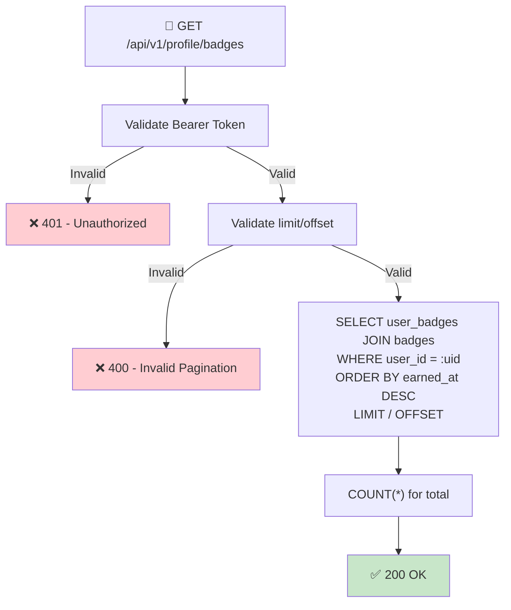

## 📝 Change History
| Date | Version | Changes | Status |
|------|---------|---------|--------|
| 2026-05-16 | 1.1.0 | badges and user_badges tables now implemented (migration 5252f1c74c5d); updated checklist and implementation status | 📝 Draft |
| 2026-05-15 | 1.0.0 | Initial creation | 📝 Draft |

# G01_F02_SF03: View Badges & Achievements

📝 Draft  
**Function**: User Profile (G01_F02)  
**Status**: ⬜ NOT STARTED (DB schema ready)  
**Priority**: Low (Phase 2)  
**Difficulty**: Easy  

---

## 📋 Description

Return the list of badges the authenticated user has earned. Each badge has a name, description, icon URL, category, and the date it was earned. Only earned badges are returned (MVP — no locked/progress view).

---

## 🎯 Detailed Requirements

### Input Parameters

**Request Headers**
```
Authorization: Bearer <access_token>
```

**Query Parameters** (optional)
```
limit   int  default=50, max=100
offset  int  default=0
```

### Output Schemas

**Success Response (200 OK)**
```json
{
  "success": true,
  "data": {
    "total": 2,
    "badges": [
      {
        "badge_id": 1,
        "name": "First Victory",
        "description": "Win your first game session",
        "icon_url": "https://cdn.mathbattle.com/badges/first_victory.png",
        "category": "game",
        "earned_at": "2026-05-02T14:30:00Z"
      }
    ]
  },
  "error": null
}
```

**Error Responses**

Error codes: `UNAUTHORIZED` (401), `INVALID_PAGINATION` (400)

```json
{
  "success": false,
  "data": null,
  "error": { "code": "UNAUTHORIZED", "message": "Authentication required" }
}
```

---

## 🗏️ Business Logic (4 Steps)

1. **Authenticate Request** — Validate Bearer token → Return 401 if invalid
2. **Validate Pagination** — `limit` ∈ [1, 100], `offset` ≥ 0 → Return 400 if out of range
3. **Fetch Earned Badges** — `SELECT user_badges JOIN badges WHERE user_id = :uid ORDER BY earned_at DESC LIMIT/OFFSET`
4. **Return 200** — Return badge list with total count; empty list is valid (total=0, badges=[])

### Badge Awarding (out of scope for this endpoint)

This endpoint only **reads** earned badges. Awarding logic (triggered by game events) is handled by the game service and is a separate concern.

---

## 🔄 Flow Diagram



---

## 💻 Backend Implementation

**Status**: ⬜ NOT STARTED  
**Location**: `app/schemas/profile.py`, `app/services/profile_service.py`, `app/api/v1/profile.py`  
**Tests**: `tests/test_profile_badges.py`

### Architecture Overview

| Component | Purpose | Details |
|-----------|---------|---------|
| **Pydantic Schemas** | Serialization | `BadgeItem`, `BadgesResponse` |
| **Service Layer** | DB query | `get_user_badges(user_id, limit, offset)` — paginated JOIN |
| **API Router** | HTTP endpoint | GET `/api/v1/profile/badges` — requires auth dependency |

### Database Tables (already created — migration 5252f1c74c5d)

| Table | Purpose |
|-------|---------|
| `badges` | Badge definitions — seeded at deployment |
| `user_badges` | Junction: which badges a user has earned |

**Seed data (5 initial badges):**

| name | description | category |
|------|-------------|----------|
| First Victory | Win your first game session | game |
| Hot Streak | Maintain a 7-day daily streak | streak |
| Century Club | Reach 1,000+ Elo (after progression) | game |
| Speed Demon | Answer 10 questions under 3 seconds each | game |
| Level 10 | Reach level 10 | game |

> Seed script is separate from the migration. Run once at deployment or via a management command.

### Implementation Highlights

⬜ **Schemas**: `BadgeItem`, `BadgesResponse` Pydantic models  
⬜ **Service**: `get_user_badges(user_id, limit, offset)` — paginated async JOIN  
⬜ **Router**: `GET /api/v1/profile/badges`  
⬜ **Seed script**: Insert 5 default badge definitions into `badges` table  
⬜ **Tests**: Empty list, earned badges, pagination, auth error  

### Future Enhancements

- Show locked/unearned badges with progress indicators
- Filter by category (`?category=streak`)
- Badge showcase (pin 3 badges to profile card)
- Push notification on badge award

---

## 📊 Security Considerations

| Area | Implementation |
|------|----------------|
| **Authentication** | Bearer token required; user_id from token, no path parameter (prevents IDOR) |
| **Pagination** | Enforce `max limit=100` to prevent large dumps |

---

## ✅ Test Coverage

### Planned Tests

- ⬜ `test_get_badges_success` — user with earned badges receives list
- ⬜ `test_get_badges_empty` — new user returns `total=0, badges=[]`
- ⬜ `test_get_badges_unauthenticated` — missing token → 401
- ⬜ `test_get_badges_pagination` — limit/offset returns correct page
- ⬜ `test_get_badges_invalid_limit` — `limit=0` or `limit=200` → 400

---

## 🚀 API Endpoint

**GET** `/api/v1/profile/badges?limit=50&offset=0`

```
Authorization: Bearer <access_token>
```

✅ **Success with badges (200)**
```json
{
  "success": true,
  "data": {
    "total": 1,
    "badges": [
      {
        "badge_id": 1,
        "name": "First Victory",
        "description": "Win your first game session",
        "icon_url": "https://cdn.mathbattle.com/badges/first_victory.png",
        "category": "game",
        "earned_at": "2026-05-02T14:30:00Z"
      }
    ]
  },
  "error": null
}
```

✅ **No badges yet (200)**
```json
{
  "success": true,
  "data": { "total": 0, "badges": [] },
  "error": null
}
```

---

## 📋 Implementation Checklist

- [x] Create `badges` table (migration 5252f1c74c5d)
- [x] Create `user_badges` table (migration 5252f1c74c5d)
- [x] Add `Badge`, `UserBadge` models in `app/models/badge.py`
- [ ] Write seed script for 5 default badges
- [ ] Define `BadgeItem`, `BadgesResponse` schemas in `app/schemas/profile.py`
- [ ] Implement `get_user_badges()` in `app/services/profile_service.py`
- [ ] Create `GET /api/v1/profile/badges` route in `app/api/v1/profile.py`
- [ ] Register profile router in `app/main.py` (shared with SF01, SF02)
- [ ] Write tests and confirm all pass

---

## 🔗 Related Documentation

- **Database Models**: `app/models/badge.py`, `app/models/user.py`
- **Auth Dependency**: `app/api/deps.py`
- **Service Logic**: `app/services/profile_service.py`
- **API Router**: `app/api/v1/profile.py`
- **Test Suite**: `tests/test_profile_badges.py`
- **Related Specs**: G01_F02_SF01, G01_F02_SF02

---

**Last Updated**: 2026-05-16  
**Implementation Status**: ⬜ NOT STARTED (DB schema ✅ ready)  
**Test Status**: ⬜ NOT STARTED
