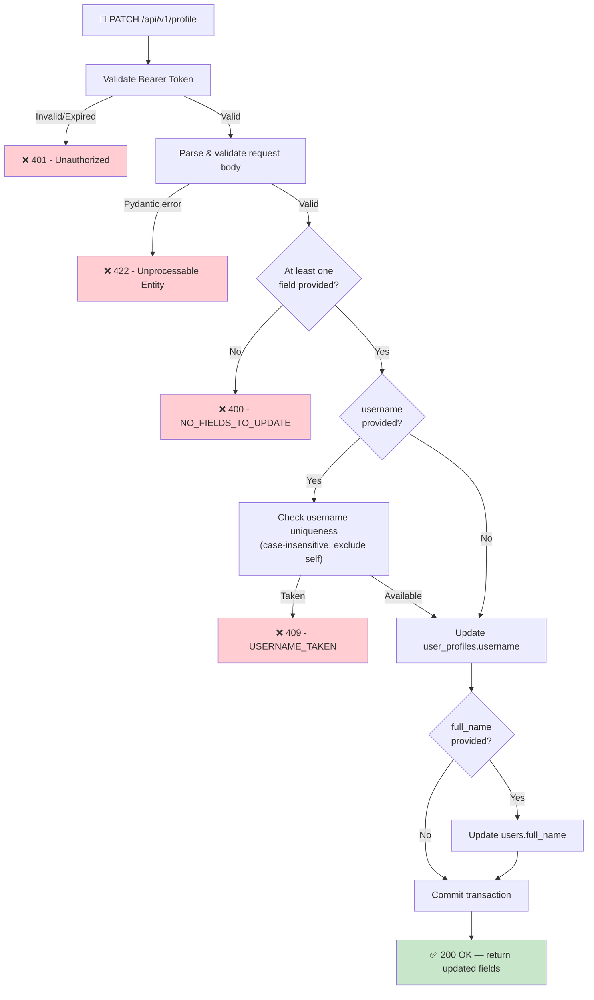

## 📝 Change History
| Date | Version | Changes | Status |
|------|---------|---------|--------|
| 2026-05-16 | 1.0.0 | Initial creation — PATCH /api/v1/profile for username and full_name | 📝 Draft |

# G01_F02_SF04: Update Profile Info

📝 Draft  
**Function**: User Profile (G01_F02)  
**Status**: ⬜ NOT STARTED  
**Priority**: Medium (Phase 2)  
**Difficulty**: Easy  

---

## 📋 Description

Allow the authenticated user to update their editable profile fields: `username` (stored in `user_profiles`) and `full_name` (stored in `users`). All fields are optional in the request body, but at least one must be provided. The endpoint performs a partial update (PATCH semantics) and returns the updated values.

---

## 🎯 Detailed Requirements

### Input Parameters

**Request Headers**
```
Authorization: Bearer <access_token>
Content-Type: application/json
```

**Request Body** (all fields optional, at least one required)
```json
{
  "username": "hải_tiến",
  "full_name": "Hải Tiến"
}
```

### Validation Rules

| Field | Type | Rules |
|-------|------|-------|
| `username` | `string` | Optional in request. 3–30 characters. No whitespace characters allowed. Unicode (Vietnamese) permitted. Must be unique (case-insensitive, excluding self). |
| `full_name` | `string` | Optional in request. 1–100 characters after trimming whitespace. |

> **Note:** "Optional in request" means the field may be omitted from the JSON body. If present, it must be a non-null string satisfying the rules above — sending `null` will return 422.

- If **neither** `username` nor `full_name` is present in the body → `400 NO_FIELDS_TO_UPDATE`
- `username` uniqueness check is **case-insensitive** and excludes the requesting user's own current username

### Output Schemas

**Success Response (200 OK)**
```json
{
  "success": true,
  "data": {
    "user_id": 1,
    "username": "hải_tiến",
    "full_name": "Hải Tiến"
  },
  "error": null
}
```

**Error Responses**

| Code | HTTP Status | Condition |
|------|-------------|-----------|
| `UNAUTHORIZED` | 401 | Missing or invalid Bearer token |
| `NO_FIELDS_TO_UPDATE` | 400 | Request body contains no recognized fields |
| `USERNAME_TAKEN` | 409 | Requested username already exists (case-insensitive) |
| Pydantic validation error | 422 | Field fails type/length constraint |

```json
{
  "success": false,
  "data": null,
  "error": { "code": "USERNAME_TAKEN", "message": "This username is already taken" }
}
```

---

## 🗏️ Business Logic (6 Steps)

1. **Authenticate Request** — Validate Bearer token via `get_current_user_id()` → Return 401 if invalid or expired
2. **Parse & Validate Body** — Pydantic validates types and lengths → Return 422 if any constraint fails
3. **Check At Least One Field** — If both `username` and `full_name` are absent from the payload → Return 400 `NO_FIELDS_TO_UPDATE`
4. **Username Uniqueness Check** — If `username` is provided, query `user_profiles` case-insensitively, excluding the current user → Return 409 `USERNAME_TAKEN` if another user owns it
5. **Apply Updates** — Write `username` to `user_profiles` and/or `full_name` to `users` within a single transaction; commit
6. **Return 200** — Respond with `user_id`, updated `username`, updated `full_name`

---

## 🔄 Flow Diagram



---

## 💻 Backend Implementation

**Status**: ⬜ NOT STARTED  
**Location**: `app/schemas/profile.py`, `app/services/profile_service.py`, `app/api/v1/profile.py`  
**Tests**: `tests/test_profile.py`

### Architecture Overview

| Component | Purpose | Details |
|-----------|---------|---------|
| **Pydantic Schema** | Request validation | `UpdateProfileRequest` — both fields `Optional`, min/max length constraints |
| **Service Layer** | DB writes | `update_profile()` — updates `user_profiles` and/or `users` in one transaction |
| **API Router** | HTTP endpoint | `PATCH /api/v1/profile` — added to existing profile router |
| **Auth Dependency** | Token validation | `get_current_user_id()` from `app/api/deps.py` |

### Database Fields Updated

| Field | Table | Column | Constraint |
|-------|-------|--------|-----------|
| `username` | `user_profiles` | `username` | String(30), unique |
| `full_name` | `users` | `full_name` | String(100), nullable |

> No schema migration needed — both columns already exist.

### Implementation Highlights

⬜ **Schema**: `UpdateProfileRequest` with `Optional[str]` fields and Pydantic validators  
⬜ **Service**: `update_profile(user_id, username, full_name)` — handles partial updates across two tables  
⬜ **Uniqueness check**: `ilike` query on `user_profiles.username` excluding `user_id == current_user`  
⬜ **Router**: `PATCH ""` added to existing `router = APIRouter(prefix="/profile")` in `profile.py`  
⬜ **Tests**: `TestUpdateProfile` class covering happy path + all error cases  

### Future Enhancements

- Username change cooldown (e.g., once per 30 days) via `username_changed_at` column
- Avatar upload (`avatar_url` field)
- Audit log of username history

---

## 📊 Security Considerations

| Area | Implementation |
|------|----------------|
| **Authentication** | Bearer token required; `get_current_user_id()` validates and extracts user_id |
| **Authorization** | Users can only update their own profile; user_id is taken from JWT, not request body |
| **Input sanitization** | `full_name` trimmed of leading/trailing whitespace before storing |
| **Username uniqueness** | Case-insensitive check prevents `User1` and `user1` collision |
| **Data Exposure** | Response returns only `user_id`, `username`, `full_name` — never email or password_hash |

---

## ✅ Test Coverage

### Planned Tests

- ⬜ `test_update_username_success` — valid new username → 200, username updated
- ⬜ `test_update_full_name_success` — valid new full_name → 200, full_name updated
- ⬜ `test_update_both_fields_success` — both fields provided → 200, both updated
- ⬜ `test_update_no_fields` — empty body → 400 `NO_FIELDS_TO_UPDATE`
- ⬜ `test_update_username_taken` — username already used by another user → 409
- ⬜ `test_update_username_same_as_self` — username same as own current username → 200 (no-op, passes uniqueness)
- ⬜ `test_update_username_too_short` — under 3 chars → 422
- ⬜ `test_update_username_too_long` — over 30 chars → 422
- ⬜ `test_update_username_with_space` — contains whitespace → 422
- ⬜ `test_update_unauthenticated` — no token → 401

---

## 🚀 API Endpoint

**PATCH** `/api/v1/profile`

```
Authorization: Bearer <access_token>
Content-Type: application/json

{
  "username": "hải_tiến",
  "full_name": "Hải Tiến"
}
```

✅ **Success (200)**
```json
{
  "success": true,
  "data": {
    "user_id": 1,
    "username": "hải_tiến",
    "full_name": "Hải Tiến"
  },
  "error": null
}
```

---

## 📋 Implementation Checklist

- [ ] Add `UpdateProfileRequest` Pydantic schema to `app/schemas/profile.py`
- [ ] Implement `update_profile()` in `app/services/profile_service.py`
- [ ] Add `PATCH /api/v1/profile` route to `app/api/v1/profile.py`
- [ ] Write tests in `tests/test_profile.py` under `TestUpdateProfile`
- [ ] Confirm all tests pass with `pytest -v`

---

## 🔗 Related Documentation

- **Database Models**: `app/models/user.py`
- **Auth Dependency**: `app/api/deps.py`
- **Service Logic**: `app/services/profile_service.py`
- **API Router**: `app/api/v1/profile.py`
- **Test Suite**: `tests/test_profile.py`
- **Related Specs**: G01_F02_SF01, G01_F02_SF02, G01_F02_SF03

---

**Last Updated**: 2026-05-16  
**Implementation Status**: ⬜ NOT STARTED  
**Test Status**: ⬜ NOT STARTED
