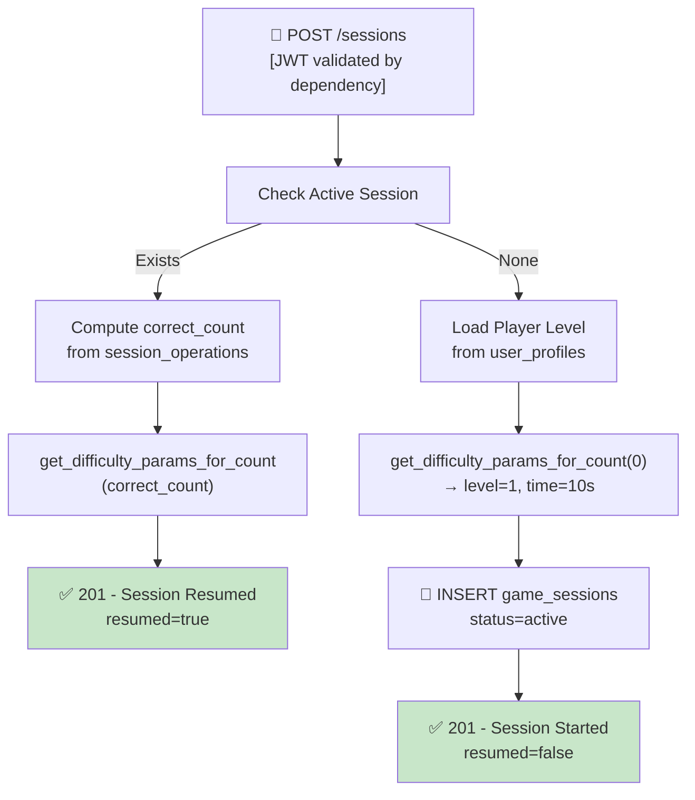

## 📝 Change History
| Date | Version | Changes | Status |
|------|---------|---------|--------|
| 2026-05-12 | 1.0.0 | Initial design | 📝 Draft |
| 2026-05-13 | 1.1.0 | Removed player difficulty selection (managed by SF06 ramp); auth treated as precondition; API router moved to `games/quick_calculate.py` for extensibility; response renamed to `initial_ramp_config` | ✅ Complete |
| 2026-05-13 | 1.2.0 | Removed `mode` parameter — game always runs endless-until-wrong (max_errors_allowed=1, max_questions=null); POST /sessions now takes no request body | ✅ Complete |
| 2026-05-14 | 1.3.0 | Refactored to Question bank architecture: `status` changed to `"active"` (was `"in_progress"`); `game_mode` now uses `GameMode` enum; `level_player_at_start` snapshot added; session no longer stores `difficulty_params` / counters — those are derived at query time | ✅ Complete |
| 2026-05-14 | 1.4.0 | Ramp switched to formula-based (`get_difficulty_params_for_count`); `initial_ramp_config` now only returns `ramp_level`, `time_limit_per_question`, `max_questions`, `max_errors_allowed` — `operation_types` and `number_range` removed (FE doesn't need them at session start); `time_limit_per_question` for level-1 player is now 15.0s (formula: 10 - correct_count/5) | ✅ Complete |
| 2026-05-14 | 1.5.0 | Session resume support: 409 replaced by resume flow — if user calls POST /sessions while a session is active, returns existing session with `resumed=true` and ramp config derived from current `correct_count` (not reset to 0); added `resumed` field to response schema | ✅ Complete |
| 2026-05-15 | 1.6.0 | `get_difficulty_params_for_count` signature changed: `player_level` parameter removed — function now takes only `correct_count`; updated all call sites in service; `time_limit_per_question` for a new session is now always `BASE_TIME_LIMIT = 10.0s` | ✅ Complete |

# G02_F04_SF01: Start Session

📝 MVP  
**Function**: Quick Calculate (G02_F04)  
**Status**: ✅ IMPLEMENTED  
**Priority**: High (Phase 2)  
**Difficulty**: Medium  

---

## 📋 Description

Start or resume a Quick Calculate game session for an authenticated player. The player enters the game with no configuration required — there is no mode or difficulty selection. If the player already has an active session (e.g. app closed mid-game), the server returns that session instead of creating a new one, with the ramp config reflecting actual progress. If no active session exists, a fresh session is created. The `resumed` field in the response tells the FE which case occurred. 

---

## 🎯 Detailed Requirements

### Input Parameters

**Request Body**: None (empty body or omit)

**Headers**
```
Authorization: Bearer <access_token>
```

**Validation Rules**
- No request body parameters required

### Output Schemas

**Success Response — New Session (201 Created)**
```json
{
  "success": true,
  "data": {
    "session_id": "uuid-v4",
    "resumed": false,
    "initial_ramp_config": {
      "ramp_level": 1,
      "time_limit_per_question": 10.0,
      "max_questions": null,
      "max_errors_allowed": 1
    },
    "started_at": "2026-05-13T10:00:00Z"
  },
  "error": null
}
```

**Success Response — Resumed Session (201 Created)**
```json
{
  "success": true,
  "data": {
    "session_id": "uuid-v4",
    "resumed": true,
    "initial_ramp_config": {
      "ramp_level": 3,
      "time_limit_per_question": 12.0,
      "max_questions": null,
      "max_errors_allowed": 1
    },
    "started_at": "2026-05-13T09:45:00Z"
  },
  "error": null
}
```

**Notes**:
- `resumed=false`: new session, `ramp_level` derived from `get_difficulty_params_for_count(0)` → level=1, time=10s
- `resumed=true`: existing session returned; `ramp_level` and `time_limit_per_question` derived from `get_difficulty_params_for_count(correct_count)` — reflects real progress, not reset to zero
- FE should use `resumed` to decide whether to show a "Continue game?" notice

Error codes: `UNAUTHORIZED` (401)

---

## 🗏️ Business Logic (5 Steps)

**Precondition**: User is authenticated — Bearer token validated via FastAPI `get_current_user_id()` dependency before this function executes.

1. **Check Active Session** - Query `game_sessions` for any `status="active"` row belonging to this user
2. **Resume if Found** - If found: compute `correct_count` from `session_operations`, call `get_difficulty_params_for_count(correct_count)`, return existing session with `resumed=true`
3. **Load Initial Ramp Config** - If not found: call `get_difficulty_params_for_count(0)` → `{level=1, time_limit=10s}`; `max_errors_allowed=1` and `max_questions=null` are service constants
4. **Create Session Record** - INSERT into `game_sessions` with `status="active"`, `game_mode=GameMode.QUICK_CALCULATE`, `user_id`, and `level_player_at_start` (from `user_profiles.current_level`, default 1 if no profile); no counters stored — computed from `session_operations` at query time
5. **Return Session Data** - HTTP 201 with session_id, resumed=false, initial ramp config, and started_at timestamp

---

## 🔄 Flow Diagram



---

## 💻 Backend Implementation

**Status**: ✅ IMPLEMENTED  
**Location**: `app/api/v1/games/quick_calculate.py`, `app/services/quick_calculate_service.py`  
**Tests**: `tests/test_quick_calculate.py::TestStartSession`

### Architecture Overview

| Component | Purpose | Details |
|-----------|---------|---------|
| **Service Layer** | Business logic | Session creation, ramp config loading |
| **API Router** | HTTP endpoint | POST `/api/v1/games/quick-calculate/sessions` returns 201 |
| **Database Models** | Persistence | `game_sessions` table |
| **Ramp Config** | Initial params | `get_difficulty_params_for_count(0)` in `difficulty_ramp.py` |

### Implementation Highlights

✅ **Session resume**: If an active session exists for the user, it is returned with `resumed=true` and ramp config derived from current `correct_count` — no 409 raised  
✅ **Session creation**: INSERT into `game_sessions` with `status="active"`, `game_mode=GameMode.QUICK_CALCULATE`, `level_player_at_start` from user profile  
✅ **`resumed` flag in response**: FE uses this to distinguish new session from resume (e.g. show "Continue game?" notice)  
✅ **Ramp continuity on resume**: `get_difficulty_params_for_count(correct_count)` — difficulty reflects real progress, not reset to zero  
✅ **No request body**: Endpoint accepts no input — game mode is fixed  
✅ **No counters in session**: `correct_count`, `wrong_count`, `streak` computed from `session_operations` at query time  
✅ **Async DB operations**: All queries via async SQLAlchemy session  

### Future Enhancements

- Support guest sessions (no auth required)

---

## 📊 Security Considerations

| Area | Implementation |
|------|----------------|
| **Auth** | Bearer token required via FastAPI dependency; user_id extracted from JWT |
| **Session Isolation** | Each session scoped to user_id; cannot access others' sessions |
| **Server-controlled Difficulty** | Ramp config loaded server-side; client cannot manipulate difficulty or timing |

---

## ✅ Test Coverage

### Success Cases
- [x] `test_session_id_in_response` - Session created, ID returned in response
- [x] `test_initial_ramp_level_is_1` - ramp_level=1, time_limit=10s, max_errors=1, max_questions=null
- [x] `test_resume_returns_existing_session` - Active session exists → resumed=true, same session_id returned
- [x] `test_resume_ramp_reflects_progress` - Resumed session ramp_level matches current correct_count

### Error Cases
- [x] `test_unauthenticated_returns_401` - No token → 401

---

## 🚀 API Endpoint

**POST** `/api/v1/games/quick-calculate/sessions`

**Request Headers**
```
Authorization: Bearer <access_token>
```

**Request Body**: None

**Response Example — New Session (201)**
```json
{
  "success": true,
  "data": {
    "session_id": "550e8400-e29b-41d4-a716-446655440000",
    "resumed": false,
    "initial_ramp_config": {
      "ramp_level": 1,
      "time_limit_per_question": 10.0,
      "max_questions": null,
      "max_errors_allowed": 1
    },
    "started_at": "2026-05-13T10:00:00Z"
  },
  "error": null
}
```

**Response Example — Resumed Session (201)**
```json
{
  "success": true,
  "data": {
    "session_id": "550e8400-e29b-41d4-a716-446655440000",
    "resumed": true,
    "initial_ramp_config": {
      "ramp_level": 3,
      "time_limit_per_question": 12.0,
      "max_questions": null,
      "max_errors_allowed": 1
    },
    "started_at": "2026-05-13T09:45:00Z"
  },
  "error": null
}
```

---

## 📋 Implementation Checklist

- [x] `game_sessions` database model
- [x] Ramp config — `get_difficulty_params_for_count(0)` with constants `max_errors_allowed=1`, `max_questions=null`
- [x] Service: `start_session(user_id, db)` — no mode parameter
- [x] API router: POST `/api/v1/games/quick-calculate/sessions` (no body)
- [x] Active session guard
- [x] Test suite

---

## 🔗 Related Documentation

- **Database Models**: `app/models/game_session.py`
- **Test Suite**: `tests/test_quick_calculate.py`
- **API Router**: `app/api/v1/games/quick_calculate.py`
- **Service Logic**: `app/services/quick_calculate_service.py`
- **Ramp Config**: `app/utils/difficulty_ramp.py`
- **Related Specs**: [G02_F04_SF02](G02_F04_SF02.md) (Generate Next Operation), [G02_F04_SF06](G02_F04_SF06.md) (Difficulty Ramp), [G02_F04_SF07](G02_F04_SF07.md) (End Session)

---

**Last Updated**: 2026-05-15 (v1.6.0)  
**Implementation Status**: ✅ IMPLEMENTED  
**Test Status**: ✅ ALL PASSING
