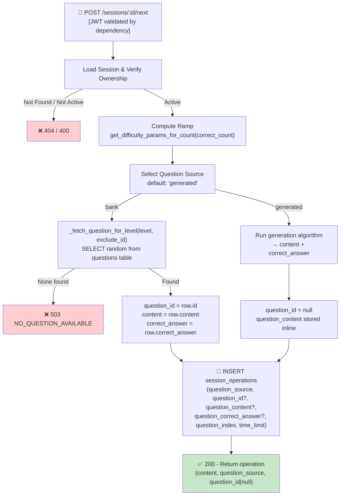

## 📝 Change History
| Date | Version | Changes | Status |
|------|---------|---------|--------|
| 2026-05-12 | 1.0.0 | Initial design | 📝 Draft |
| 2026-05-13 | 1.1.0 | Auth as precondition; API router moved to `games/quick_calculate.py` | ✅ Complete |
| 2026-05-14 | 2.0.0 | Question bank architecture: operation now generates a `Question` record and links it via FK; ramp params derived from `correct_count` (no longer from `session.difficulty_params`); response changed to `content` dict instead of flat fields; `generated_at` uses `session_operation.created_at` | ✅ Complete |
| 2026-05-14 | 2.1.0 | Ramp switched to `get_difficulty_params_for_count(correct_count, level_player_at_start)` (formula-based, player-level-aware); `get_level_config(level)` derives `number_range` + `operation_types`; `operation_generator.py` deleted — question generation now inline via `_generate_math_question()` in the service | ✅ Complete |
| 2026-05-14 | 2.2.0 | Removed inline question generation — SF02 now fetches a random pre-seeded question from the `questions` table by `difficulty_level`; `_generate_math_question()` and `_get_previous_op_tuple()` removed; replaced with `_fetch_question_for_level()` + `_get_last_question_id()`; `content` response field simplified to the display string stored in `questions.content` | ✅ Complete |
| 2026-05-14 | 3.0.0 | Hybrid question source implemented: `session_operations` now has `question_source VARCHAR(50)`, nullable `question_id`, `question_content TEXT`, `question_correct_answer BIGINT`. `_resolve_correct_answer()` helper added to service. SF03 + SF05 updated to use helper. `question_source` added to SF02 API response. Migration `02519bcc6fd4` applied. Algorithm for `"generated"` source TBD. | ✅ Complete |
| 2026-05-15 | 3.1.0 | Default question source switched to `"generated"` — `generate_math_question(level)` from `question_generator.py` (SF09) is now called for every operation; `"bank"` path remains in code but is not used by default. `player_level` parameter removed from `get_difficulty_params_for_count()` — call site updated to `get_difficulty_params_for_count(correct_count)`. | ✅ Complete |

# G02_F04_SF02: Generate Next Operation

📝 MVP  
**Function**: Quick Calculate (G02_F04)  
**Status**: ✅ IMPLEMENTED (v3.0)  
**Priority**: High (Phase 2)  
**Difficulty**: Medium  

---

## 📋 Description

Generate the next math operation for the session. Ramp difficulty is derived from the session's running correct answer count (no persistent difficulty state needed). Prevents consecutive duplicate operations.

**Question source (v3.0 design):** SF02 will support two question sources, controlled by a `question_source` field on each operation:

- **`"bank"`** — fetches a pre-seeded question from the `questions` table (current behavior)
- **`"generated"`** — creates a question algorithmically at runtime; content + correct answer are stored directly in `session_operations` (no `questions` row created)

The algorithm for generated questions will be defined separately and plugged in via a strategy function.

---

## 🎯 Detailed Requirements

### Input Parameters

**URL Parameter**: `session_id` (UUID v4, path param)

**Headers**
```
Authorization: Bearer <access_token>
```

**Validation Rules**
- `session_id`: Must exist, belong to authenticated user, and have `status="active"`

### Output Schemas

**Success Response (200 OK)**
```json
{
  "success": true,
  "data": {
    "operation_id": "uuid-v4",
    "question_id": "uuid-v4 | null",
    "question_source": "bank | generated",
    "question_index": 3,
    "content": "24 ÷ 6 = ?",
    "time_limit": 8.0,
    "generated_at": "2026-05-14T10:00:05Z"
  },
  "error": null
}
```

**Notes**:
- `correct_answer` is **never** sent to the client regardless of source
- `question_id` is `null` when `question_source = "generated"`
- `content` is always the display string shown to the player

Error codes: `SESSION_NOT_FOUND` (404), `SESSION_NOT_ACTIVE` (400), `NO_QUESTION_AVAILABLE` (503), `UNAUTHORIZED` (401)

---

## 🗏️ Business Logic (v3.0 Design — 6 Steps)

**Precondition**: User is authenticated — Bearer token validated via FastAPI `get_current_user_id()` dependency.

1. **Load Session** - Fetch session by session_id, verify owner = user_id, `status="active"` → 404/400 if not valid
2. **Compute Ramp** - Call `get_difficulty_params_for_count(correct_count)` → `{"level", "time_limit"}`
3. **Select Question Source** - Current default: `"generated"` — `generate_math_question(level)` from `question_generator.py`; `"bank"` path remains available in the service but is not the default
4. **Resolve Question**:
   - If `source = "bank"`: call `_fetch_question_for_level(level, exclude_id)` → `Question` row; set `question_id`, `question_content=None`, `question_correct_answer=None`
   - If `source = "generated"`: call question generation algorithm → `{content: str, correct_answer: int}`; set `question_id=None`, `question_content`, `question_correct_answer`
5. **Create Session Operation** - INSERT into `session_operations` with `question_source`, `question_id` (nullable), `question_content` (nullable), `question_correct_answer` (nullable), `question_index=total_count`, `time_limit`
6. **Return** - Response includes `content`, `question_source`, `question_id` (null if generated), `time_limit`; `correct_answer` never sent

---

## 🔄 Flow Diagram



---

## 💻 Backend Implementation

**Status**: ✅ IMPLEMENTED  
**Location**: `app/api/v1/games/quick_calculate.py`, `app/services/quick_calculate_service.py`  
**Tests**: `tests/test_quick_calculate.py::TestNextOperation`

### Architecture Overview (v3.0 Design)

| Component | Purpose | Details |
|-----------|---------|---------|
| **`questions` table** | Question bank | Pre-seeded questions; optional — only used when `question_source="bank"` |
| **`session_operations` table** | Player actions | Hybrid: links to `questions` via nullable FK **or** stores inline content+answer for generated questions |
| **`get_difficulty_params_for_count(correct_count)`** | Level + timing | Returns `{"level", "time_limit"}` — formula-based, no player-level dependency |
| **`generate_math_question(level)`** (SF09) | Generated question | Returns `{content: str, correct_answer: int}` — current default source |
| **`_fetch_question_for_level(level, exclude_id)`** | Bank fetch | Selects random `Question` at `difficulty_level=level`; available but not the current default |

---

### `session_operations` — Schema (v3.0, implemented)

The table is **source-agnostic**. One row always represents one question presented to the player, regardless of where it came from.

```
session_operations
├── id                      UUID PK
├── session_id              UUID FK → game_sessions (NOT NULL)
├── user_id                 INT FK → users (NOT NULL)
├── question_index          INT NOT NULL              -- 0-based position in session
├── time_limit              FLOAT NOT NULL
│
├── question_source         VARCHAR(50) NOT NULL      -- "bank" | "generated"
├── question_id             UUID FK → questions       -- nullable; set only when source="bank"
├── question_content        TEXT                      -- nullable; set only when source="generated"
│                                                     -- TEXT (unlimited) supports multi-operation
│                                                     -- expressions like "1234 + 56 × 78 - 9 = ?"
├── question_correct_answer BIGINT                    -- nullable; set only when source="generated"
│                                                     -- BIGINT handles chained multiplications
│                                                     -- of large operands (up to ~9×10^18)
│
├── user_answer             INT
├── submitted_at            TIMESTAMP
├── client_submitted_at     TIMESTAMP                 -- client-reported time (analytics only)
├── is_correct              BOOL
├── timed_out               BOOL NOT NULL DEFAULT false
├── evaluated_at            TIMESTAMP
│
├── created_at              TIMESTAMP NOT NULL
└── updated_at              TIMESTAMP NOT NULL
```

**Source rules** (enforced at service layer):

| `question_source` | `question_id` | `question_content` | `question_correct_answer` |
|---|---|---|---|
| `"bank"` | NOT NULL (FK) | NULL | NULL |
| `"generated"` | NULL | NOT NULL | NOT NULL |

**Correct answer resolution** — `_resolve_correct_answer(operation, db)`:
```python
if operation.question_source == "bank":
    return (await _get_question(operation.question_id, db)).correct_answer
return operation.question_correct_answer  # "generated"
```

**Answer hiding**: `question_correct_answer` is a server-only column — never included in any API response.

---

### Implementation Highlights

✅ **Hybrid source schema**: `question_source`, nullable `question_id`, `question_content TEXT`, `question_correct_answer BIGINT` added to `session_operations` (migration `02519bcc6fd4`)  
✅ **`_resolve_correct_answer(operation, db)`**: single helper resolves correct answer from either source — used by SF03 (timeout) and SF05 (evaluate answer)  
✅ **`question_source` in response**: SF02 response includes `question_source` and nullable `question_id`  
✅ **Default source `"generated"`**: `generate_math_question(level)` from `question_generator.py` (SF09) called for every operation  
✅ **DB fetch (bank)**: `_fetch_question_for_level()` available — selects random `Question` at ramp level with anti-repeat and fallback; not the current default  
✅ **Ramp derivation**: `get_difficulty_params_for_count(correct_count)` — formula-based, no player-level dependency  
✅ **Answer hiding**: `correct_answer` never sent to client regardless of source  
✅ **503 guard**: `GenerationError` from question generator mapped to HTTP 503  

### Future Enhancements

- Multi-operand operations: `12 + 5 × 3 = ?`
- Support non-math question types (sequence, MCQ)
- Admin tool for bulk-importing questions into the bank

---

## 📊 Security Considerations

| Area | Implementation |
|------|----------------|
| **Answer Hiding** | For `source="bank"`: `correct_answer` in `questions` table only. For `source="generated"`: `question_correct_answer` in `session_operations` only. Neither ever sent to client. |
| **Session Ownership** | `user_id` verified against `session.user_id` |
| **Server-controlled Difficulty** | Ramp computed server-side from `correct_count`; client cannot manipulate |
| **Inline answer protection** | `question_correct_answer` column is excluded from all API response serialization |

---

## ✅ Test Coverage

### Success Cases
- [x] `test_returns_operation_fields` - Response includes `operation_id`, `question_id`, `content`, `time_limit`, `generated_at`
- [x] `test_correct_answer_not_in_response` - `correct_answer` absent from response and `content`
- [x] `test_question_index_starts_at_zero` - First operation has `question_index=0`
- [x] `test_time_limit_matches_ramp_level_1` - `time_limit=10.0` at ramp_level=1 (formula: BASE_TIME_LIMIT + 0 × TIME_BONUS_PER_LEVEL)

### Error Cases
- [x] `test_invalid_session_returns_404` - Non-existent session_id → 404

---

## 🚀 API Endpoint

**POST** `/api/v1/games/quick-calculate/sessions/{session_id}/next`

**Response Example (200)**
```json
{
  "success": true,
  "data": {
    "operation_id": "6ba7b810-9dad-11d1-80b4-00c04fd430c8",
    "question_id": "550e8400-e29b-41d4-a716-446655440000",
    "question_index": 3,
    "content": "24 ÷ 6 = ?",
    "time_limit": 8.0,
    "generated_at": "2026-05-14T10:00:05Z"
  },
  "error": null
}
```

---

## 📋 Implementation Checklist

**v2.2 (current)**
- [x] `questions` database model (`type`, `content` JSON, `correct_answer` JSON, `difficulty_level`)
- [x] `session_operations` model with `question_id` FK
- [x] `get_difficulty_params_for_count(correct_count)` in `difficulty_ramp.py`
- [x] `_fetch_question_for_level(level, exclude_id)` — random DB fetch with anti-repeat + fallback (bank path)
- [x] `_get_last_question_id(session_id)` — anti-repeat helper (bank path)
- [x] Service: `generate_next_operation(session_id, user_id, db)`
- [x] API router: POST `/api/v1/games/quick-calculate/sessions/{id}/next`
- [x] Test suite (uses `seeded_questions` fixture for pre-populated question bank)

**v3.0 (implemented)**
- [x] Alembic migration `02519bcc6fd4`: `question_source VARCHAR(50) DEFAULT 'bank'`, `question_id` nullable, `question_content TEXT`, `question_correct_answer BIGINT`
- [x] `SessionOperation` model updated with new columns
- [x] `generate_next_operation` branches on `question_source`; `"bank"` path implemented
- [x] `_resolve_correct_answer(operation, db)` helper — used by SF03 and SF05
- [x] SF05 `submit_answer` uses `_resolve_correct_answer` instead of direct `_get_question`
- [x] SF03 `record_timeout` uses `_resolve_correct_answer`
- [x] API response includes `question_source` and nullable `question_id`
- [x] Test: `test_question_source_is_generated` — verifies current default source is `"generated"` with null `question_id`
- [x] Question generation algorithm — `generate_math_question(level)` from `question_generator.py` (SF09)

---

## 🔗 Related Documentation

- **Database Models**: `app/models/question.py`, `app/models/session_operation.py`
- **Test Suite**: `tests/test_quick_calculate.py`
- **API Router**: `app/api/v1/games/quick_calculate.py`
- **Service Logic**: `app/services/quick_calculate_service.py`
- **Utils**: `app/utils/difficulty_ramp.py`
- **Related Specs**: [G02_F04_SF01](G02_F04_SF01.md) (Start Session), [G02_F04_SF03](G02_F04_SF03.md) (Timeout), [G02_F04_SF06](G02_F04_SF06.md) (Difficulty Ramp)

---

**Last Updated**: 2026-05-15 (v3.1.0)  
**Implementation Status**: ✅ IMPLEMENTED (generated source default)  
**Test Status**: ✅ ALL PASSING
