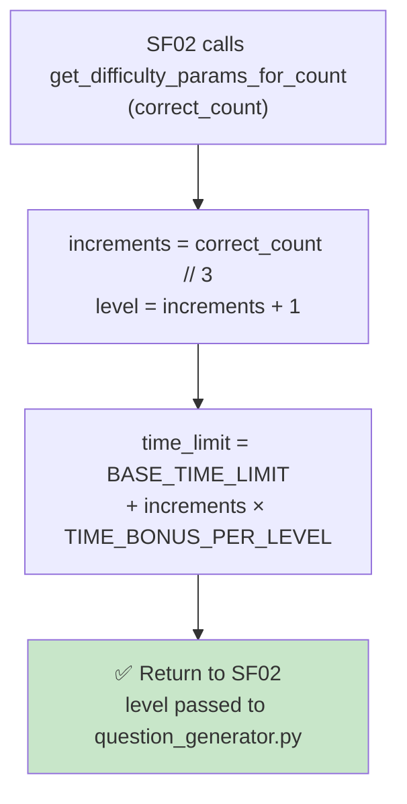

## 📝 Change History
| Date | Version | Changes | Status |
|------|---------|---------|--------|
| 2026-05-12 | 1.0.0 | Initial design | 📝 Draft |
| 2026-05-13 | 1.1.0 | SF01 now loads initial ramp params from this config; SF06 owns all difficulty progression after session start | ✅ Complete |
| 2026-05-13 | 1.2.0 | Updated initial params: max_questions=null (unlimited), max_errors_allowed=1 (game ends on first wrong answer or timeout) | ✅ Complete |
| 2026-05-14 | 1.3.0 | Added `get_ramp_params_for_count(correct_count)` — derives ramp level directly from correct_count without reading `session.difficulty_params` (session no longer stores difficulty state) | ✅ Complete |
| 2026-05-14 | 1.4.0 | Simplified `get_ramp_params_for_count()` to return only `{"level", "time_limit"}` — question-generation config (number_range, operation_types) moved to `get_level_config(level)` to separate concerns | ✅ Complete |
| 2026-05-14 | 1.5.0 | Replaced `RAMP_TABLE` + `RampStep` with formula-based approach: `level = max(player_level - 5, 1) + correct_count // 5`, `time_limit = 15 - correct_count // 5` (clamped at 3s). Renamed `get_ramp_params_for_count` → `get_difficulty_params_for_count(correct_count, player_level)`. `get_level_config(level)` now formula-based (`max_num = 10 + level * 10`). `evaluate_ramp`, `get_initial_ramp_params`, `RAMP_TABLE` removed. `operation_generator.py` deleted — generation moved inline to service. | ✅ Complete |
| 2026-05-14 | 1.6.0 | Changed `BASE_TIME_LIMIT` from 15s → 10s; extracted as named constant `BASE_TIME_LIMIT = 10.0` in `difficulty_ramp.py` | ✅ Complete |
| 2026-05-15 | 2.0.0 | Simplified ramp: removed `player_level` parameter — function signature is now `get_difficulty_params_for_count(correct_count)`. New formula: `level = correct_count // 3 + 1` (level-up every 3 correct, not 5). Time limit now **increases** with level: `time_limit = BASE_TIME_LIMIT + increments * TIME_BONUS_PER_LEVEL`. Added `TIME_BONUS_PER_LEVEL = 1.0` constant. Removed `MIN_TIME_LIMIT` and `get_level_config()` — question generation config is now owned by `question_generator.py` (SF09). | ✅ Complete |

# G02_F04_SF06: Increase Difficulty / Speed Ramp

📝 MVP  
**Function**: Quick Calculate (G02_F04)  
**Status**: ✅ IMPLEMENTED  
**Priority**: Medium (Phase 2)  
**Difficulty**: Medium  

---

## 📋 Description

Adjust difficulty and speed based on the player's progress: increase the time allowed per question (rewarding progress) and drive harder question generation via a rising level number, using a formula derived solely from the session's correct answer count. Called internally before every new question (SF02). The game has no question limit — it runs until the player answers incorrectly or times out (`max_errors_allowed=1`).

---

## 🎯 Detailed Requirements

### Input Parameters

SF06 is called internally by SF02 before each question. No dedicated endpoint for MVP.

**Internal call parameters**
```python
get_difficulty_params_for_count(
    correct_count: int,   # session's current correct answer count
) -> dict                 # {"level": int, "time_limit": float}
```

### Output Schemas

Returned directly to SF02 for question generation — not persisted to the session.

```python
# get_difficulty_params_for_count result
{"level": int, "time_limit": float}
# "level" is passed to question_generator.py (SF09) which owns number range + operator logic
```

---

## 🗏️ Business Logic (2 Steps)

1. **Compute Level** - `increments = correct_count // 3`; `level = increments + 1` — grows by 1 for every 3 correct answers; starts at 1
2. **Compute Time Limit** - `time_limit = BASE_TIME_LIMIT + increments * TIME_BONUS_PER_LEVEL` — starts at 10s, increases by 1s per level increment, rewarding the player's progress with more time as questions get harder

---

## 🔄 Flow Diagram



---

## 💻 Backend Implementation

**Status**: ✅ IMPLEMENTED  
**Location**: `app/utils/difficulty_ramp.py`, `app/services/quick_calculate_service.py`  
**Tests**: `tests/test_quick_calculate.py::TestDifficultyRamp`

### Architecture Overview

| Component | Purpose | Details |
|-----------|---------|---------|
| **`get_difficulty_params_for_count(correct_count)`** | Level + timing | Returns `{"level": int, "time_limit": float}` — formula-based, no player-level dependency |
| **`BASE_TIME_LIMIT`** | Starting time limit | Constant `10.0s` — time_limit at correct_count=0 |
| **`TIME_BONUS_PER_LEVEL`** | Time per increment | Constant `1.0s` — added once per level increment |
| **`question_generator.py` (SF09)** | Question-generation config | Owns operator unlock thresholds and operand ranges for each level |
| **Service Layer** | Integration | `generate_next_operation` calls `get_difficulty_params_for_count()` then `generate_math_question(level)` |
| **Database Models** | Persistence | No session column — ramp derived on demand from `correct_count` |

### Ramp Formula

```
increments  = correct_count // 3
level       = increments + 1
time_limit  = BASE_TIME_LIMIT + increments * TIME_BONUS_PER_LEVEL
           = 10.0 + increments * 1.0
```

**Example**

| correct_count | increments | level | time_limit |
|---------------|-----------|-------|------------|
| 0–2 | 0 | 1 | 10s |
| 3–5 | 1 | 2 | 11s |
| 6–8 | 2 | 3 | 12s |
| 9–11 | 3 | 4 | 13s |
| 30–32 | 10 | 11 | 20s |

**Time limit direction**: Increases with progress — harder questions (higher level) give the player more time to compensate for complexity.

**Session termination**: `max_errors_allowed=1` — the session auto-ends immediately on the first wrong answer or timeout.

### Implementation Highlights

✅ **`get_difficulty_params_for_count(correct_count)`**: Formula-based; returns `{"level", "time_limit"}` — no player-level dependency  
✅ **`BASE_TIME_LIMIT = 10.0`**: Starting time limit constant  
✅ **`TIME_BONUS_PER_LEVEL = 1.0`**: Time bonus added per level increment  
✅ **No session difficulty state**: Ramp derived on demand from `correct_count`  
✅ **Unlimited questions**: `max_questions=None` — ramp continues indefinitely until wrong answer  
✅ **Question config owned by SF09**: `question_generator.get_question_config(level)` handles operator thresholds and number ranges  

### Future Enhancements

- Streak-based ramp (3 consecutive correct → speed up)
- Per-user adaptive ramp based on historical performance
- Configurable ramp tables per game type

---

## 📊 Security Considerations

| Area | Implementation |
|------|----------------|
| **Server-controlled** | Ramp params computed server-side; client cannot manipulate difficulty |
| **No client input** | `correct_count` is derived from `session_operations` rows, not from client payload |
| **Config validation** | Ramp constants (`BASE_TIME_LIMIT`, `TIME_BONUS_PER_LEVEL`) are hardcoded, not runtime user input |

---

## ✅ Test Coverage

### Unit Tests (no HTTP — `TestDifficultyRamp`)
- [x] `test_zero_correct_starts_at_level_1_and_base_time` - correct_count=0 → level=1, time_limit=BASE_TIME_LIMIT, only 2 keys
- [x] `test_correct_count_advances_level_every_3` - 0–2 correct → level=1; 3 correct → level=2; 6 correct → level=3; 9 correct → level=4
- [x] `test_time_limit_increases_with_correct_count` - 0 correct → BASE_TIME_LIMIT; 3 correct → BASE_TIME_LIMIT + TIME_BONUS_PER_LEVEL; 6 correct → BASE_TIME_LIMIT + 2×TIME_BONUS_PER_LEVEL
- [x] `test_time_limit_never_below_base` - time_limit ≥ BASE_TIME_LIMIT for all correct_counts

---

## 🚀 API Endpoint

SF06 has no dedicated API endpoint. It is an internal utility function called after every answer submission or timeout.

The updated difficulty params are automatically applied by SF02 when generating the next question.

---

## 📋 Implementation Checklist

- [x] `get_difficulty_params_for_count(correct_count)` — formula-based; returns `{"level", "time_limit"}`
- [x] `BASE_TIME_LIMIT = 10.0` — starting time limit constant
- [x] `TIME_BONUS_PER_LEVEL = 1.0` — seconds added per level increment
- [x] Integration in `generate_next_operation` (SF02 calls function before each question)
- [x] `_check_end_conditions(wrong_count)` in service (max_errors=1 constant, no session state)
- [x] Unit tests for `get_difficulty_params_for_count`

---

## 🔗 Related Documentation

- **Database Models**: `app/models/game_session.py`
- **Test Suite**: `tests/test_quick_calculate.py`
- **Utils**: `app/utils/difficulty_ramp.py`
- **Service Logic**: `app/services/quick_calculate_service.py`
- **Related Specs**: [G02_F04_SF01](G02_F04_SF01.md) (Start Session), [G02_F04_SF03](G02_F04_SF03.md) (Timeout), [G02_F04_SF05](G02_F04_SF05.md) (Evaluate Answer), [G02_F04_SF02](G02_F04_SF02.md) (Generate Next Operation)

---

**Last Updated**: 2026-05-15 (v2.0.0)  
**Implementation Status**: ✅ IMPLEMENTED  
**Test Status**: ✅ ALL PASSING
