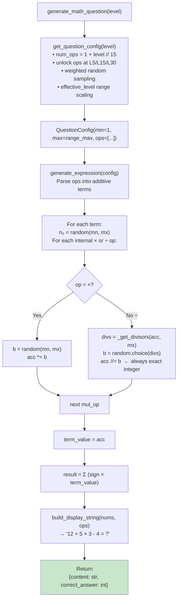

## 📝 Change History
| Date | Version | Changes | Status |
|------|---------|---------|--------|
| 2026-05-15 | 1.0.0 | Initial design — difficulty model, config bands, retry-based generation | ✅ Complete |
| 2026-05-15 | 1.1.0 | Redesigned to single-pass guaranteed generation: constrained forward sampling eliminates retry loop entirely | ✅ Complete |
| 2026-05-15 | 1.2.0 | Config table redesigned to per-level granularity: range increases gradually within each operation plateau; range resets when a new difficulty dimension is added | ✅ Complete |
| 2026-05-15 | 1.3.0 | Config table expanded to ~100 levels: each operation type gets its own phase; num_ops and number_range grow gradually within each phase before introducing the next operation | ✅ Complete |
| 2026-05-15 | 2.0.0 | Redesigned algorithms: removed MAX_ANSWER result cap (result is unconstrained); MIN=1 allowed; `÷` uses pick-from-divisors (prime fallback = acc itself); Algorithm B simplified | ✅ Complete |
| 2026-05-15 | 3.0.0 | Implemented: formula-based difficulty (not phase table), simplified QuestionConfig (`min`, `max`, `ops`), single unified PEMDAS algorithm via additive-term decomposition, weighted operator sampling, effective_level range scaling | ✅ Complete |
| 2026-05-20 | 3.0.1 | DB schema: `session_operations.question_correct_answer` BIGINT→JSON, `user_answer` INT→JSON, `operation_type VARCHAR(50)` added (NULL for Quick Calculate). No logic changes. | 🔄 In Progress |

# G02_F04_SF09: Generate Math Question (Algorithm)

✅ Implemented  
**Function**: Quick Calculate (G02_F04)  
**Status**: ✅ IMPLEMENTED  
**Priority**: High (Phase 3)  
**Difficulty**: Medium  

---

## 📋 Description

Pure algorithm that generates a math question at a given difficulty level. Returns a display string and the correct integer answer. No database interaction — this is the `"generated"` source path in SF02.

**Core design principle — single-pass generation:**  
Operators are first sampled based on the level (threshold + weighted random), then operands are generated left-to-right using additive-term decomposition. Division operands are always picked from actual integer divisors of the running accumulator, so the result is always a clean integer. No retry loop is ever needed.

**Note on test suite:** `tests/test_question_generator.py` imports symbols (`OperandRange`, `select_operators`, `generate_same_precedence`, `generate_pemdas`, `evaluate_expression`, `_parse_additive_terms`) that are **not yet present** in the current implementation. Those tests will fail on import until the extended API is added.

---

## 🎯 Detailed Requirements

### Input / Output

```python
generate_math_question(level: int) -> dict[str, int | str]
# Returns:
# {
#   "content": "12 + 5 × 3 - 4 = ?",
#   "correct_answer": 23
# }
```

### Hard Constraints (all enforced during generation, not post-hoc)
- `correct_answer` is always an exact integer — division always produces a clean quotient
- `correct_answer` is **unconstrained** — operands are bounded but the result is not
- All operands sampled from `[1, MAX]` where `MAX` is determined by the effective difficulty level
- Division divisors are always **positive** integers picked from actual integer divisors of the running accumulator
- `content` uses Unicode `×` (U+00D7) and `÷` (U+00F7) symbols for display

---

## 🏗️ Difficulty Model

Difficulty is determined by a **formula-based approach** (not a phase lookup table). Three factors scale with level:

| Factor | How it scales |
|--------|--------------|
| **`num_ops`** | `1 + level // DIFFICULTY_COEFFICIENT` (DIFFICULTY_COEFFICIENT = 15) — grows by 1 every 15 levels |
| **`allowed_ops`** | Unlocks at thresholds: `+` always; `−` at L5; one of `×`/`÷` at L15; both `×` and `÷` at L30 |
| **`number_range`** | Determined by `MAX_RANGE_LEVELS[effective_level - 1]`; `effective_level` is reduced when `×`/`÷` are selected to compensate for larger multiplicative values |

### Operator Unlock Thresholds

| Level range | Available operators |
|-------------|---------------------|
| 1 – 4 | `+` only |
| 5 – 14 | `+`, `−` |
| 15 – 29 | `+`, `−`, **one of** `×` or `÷` (chosen randomly each call) |
| 30 + | `+`, `−`, `×`, `÷` |

### Operator Sampling Weights

Once the allowable set is built, each operator slot is filled by weighted random:

| Operator | Weight |
|----------|--------|
| `+` | 5 |
| `−` | 3 |
| `×` | 2 |
| `÷` | 1 |

### Operand Range Scaling (`MAX_RANGE_LEVELS`)

```python
MAX_RANGE_LEVELS = 2*[10] + 3*[20] + 5*[30] + 7*[50] + 11*[100] + 13*[200] + 17*[500] + 19*[1000]
# Total 77 entries; effective_level ≥ 78 is capped at index 76 (max=1000)
```

| effective_level | max operand |
|-----------------|-------------|
| 1 – 2 | 10 |
| 3 – 5 | 20 |
| 6 – 10 | 30 |
| 11 – 17 | 50 |
| 18 – 28 | 100 |
| 29 – 41 | 200 |
| 42 – 58 | 500 |
| 59 – 77 | 1000 |

**effective_level** starts equal to `level`. Each time `×` or `÷` is selected as an operator, the effective level is reduced:

```python
if op in [OP_MUL, OP_DIV]:
    effective_level = 1 + effective_level // (DIFFICULTY_COEFFICIENT // 2)  # // 7
```

After all operators are selected, a final reduction is applied:

```python
effective_level = 1 + (effective_level + level) // (DIFFICULTY_COEFFICIENT // 2)
```

This compensation ensures that levels with heavy multiplication/division use smaller operand ranges, keeping actual result magnitudes comparable across levels.

---

## 🗏️ Business Logic

### Overview

```
generate_math_question(level):
    config = get_question_config(level)          # builds operator list + range
    nums, result = generate_expression(config)   # single-pass generation
    content = build_display_string(nums, config.ops)
    return {"content": content, "correct_answer": result}
```

No retry loop. The algorithm produces a valid expression in one pass.

---

### Step 1 — `get_question_config(level)`

```
num_ops = 1 + level // 15

# Build allowable_operators
allowable = [OP_ADD]
if level >= 5:  allowable.append(OP_SUB)
if level >= 15: allowable.append(random.choice([OP_MUL, OP_DIV]))
if level >= 30: allowable.extend([OP_MUL, OP_DIV])

# Sample operator list + track effective_level
effective_level = level
ops = []
for _ in range(num_ops):
    op = random.choices(allowable, weights=[WEIGHTS[o] for o in allowable], k=1)[0]
    if op in [OP_MUL, OP_DIV]:
        effective_level = 1 + effective_level // 7
    ops.append(op)

# Final effective level for range
effective_level = 1 + (effective_level + level) // 7
range_max = MAX_RANGE_LEVELS[min(effective_level - 1, 76)]

return QuestionConfig(min=1, max=range_max, ops=ops)
```

---

### Step 2 — `generate_expression(config)` — Unified PEMDAS Algorithm

The expression is decomposed into **additive terms** — each term is a multiplicative chain. `+`/`−` operators delimit terms; `×`/`÷` extend the current term's multiplicative chain.

```
Example: ops = [+, ×, −]
  → Term₀ (sign=+1, mul_ops=[]):  just n₀
  → Term₁ (sign=+1, mul_ops=[×]): n₁ × n₂
  → Term₂ (sign=−1, mul_ops=[]):  just n₃
  result = n₀ + (n₁ × n₂) − n₃
```

```python
# Parse into terms
term_signs = [1]       # first term is always positive
term_mul_ops = [[]]

for op in config.ops:
    if op in [OP_ADD, OP_SUB]:
        term_signs.append(+1 if op == OP_ADD else -1)
        term_mul_ops.append([])
    else:
        term_mul_ops[-1].append(op)

# Generate each term
nums = []
term_values = []
for mul_ops in term_mul_ops:
    n0 = random.randint(mn, mx)
    nums.append(n0)
    acc = n0
    for op in mul_ops:
        if op == OP_MUL:
            b = random.randint(mn, mx)
            acc *= b
        else:  # OP_DIV
            divs = _get_divisors(acc, mx)   # always non-empty
            b = random.choice(divs)
            acc //= b                        # always exact integer
        nums.append(b)
    term_values.append(acc)

result = sum(sign * val for sign, val in zip(term_signs, term_values))
return nums, result
```

**Why this is always correct:**
- `×` operands are free `random(mn, mx)` — no constraint needed
- `÷` operands are drawn from `_get_divisors(acc, mx)` — `acc % b == 0` by construction
- Result is the signed sum of term values — naturally unconstrained (can be negative at high levels where `−` terms may dominate)

---

### Step 3 — `_get_divisors(n, max_val)`

```python
limit = min(n, max_val)
divs = [d for d in range(1, limit + 1) if n % d == 0]
if is_prime(n) and n > max_val:
    divs.append(n)   # prime fallback: acc ÷ acc = 1
return divs           # always non-empty (1 always divides n)
```

**Prime fallback:** If `acc` is prime and larger than `max_val`, the only divisors ≤ `max_val` would be `{1}`. The fallback adds `acc` itself, making `b = acc` and giving `acc ÷ acc = 1` as a valid answer, keeping diversity.

---

### Step 4 — `build_display_string(nums, ops)`

```python
parts = [str(nums[0])]
for op, n in zip(ops, nums[1:]):
    parts += [op, str(n)]   # × and ÷ are already Unicode
parts.append("= ?")
return " ".join(parts)
# Example: "12 + 5 × 3 - 4 = ?"
```

---

## 🔄 Flow Diagram



---

## 📐 Guarantee Summary

| Property | How it's guaranteed |
|---|---|
| `correct_answer` is exact integer | Division picks from `_get_divisors(acc, mx)` — `acc % b == 0` always |
| Division is always clean | `b` is drawn exclusively from integer divisors of `acc`; prime fallback ensures list is never empty |
| All `×` operands ∈ `[1, MAX]` | `random.randint(mn, mx)` with `mn=1` |
| `÷` divisors may exceed MAX | Prime fallback: `acc` itself used when `acc` is prime and `acc > MAX`, giving `acc ÷ acc = 1` |
| No retry loop | `_get_divisors` is always non-empty (1 always divides any n ≥ 1); `×` is unconstrained |
| Result is unconstrained | Only operands are bounded; signed term sum can be any integer |

---

## 💻 Backend Implementation

**Status**: ✅ IMPLEMENTED  
**Location**: `app/utils/question_generator.py`  
**Integration Point**: `app/services/quick_calculate_service.py` → `generate_next_operation()` `else` branch

### Public Interface

```python
# app/utils/question_generator.py

class GenerationError(Exception):
    """Raised if an algorithm invariant is violated (should never happen in practice)."""

@dataclass(frozen=True)
class QuestionConfig:
    """Question configuration produced by get_question_config().

    ops is the exact operator sequence for the expression, left to right.
    Example: [OP_ADD, OP_SUB] → a + b - c = ?

    Attributes:
        min: Lower bound for operand values (inclusive). Always 1.
        max: Upper bound for operand values (inclusive). Scales with effective_level.
        ops: Ordered list of operators; len(ops) + 1 operands are generated.
    """
    min: int
    max: int
    ops: list[str]

def get_question_config(level: int) -> QuestionConfig: ...
def generate_math_question(level: int) -> dict[str, int | str]: ...
```

### Architecture

| Component | Purpose |
|-----------|---------|
| `GenerationError` | Custom exception for algorithmic errors |
| `QuestionConfig` | Frozen dataclass: `min`, `max`, `ops` (exact operator list already resolved) |
| `get_question_config(level)` | Formula-based: `num_ops`, operator unlock thresholds, weighted sampling, effective_level range scaling |
| `generate_math_question(level)` | Top-level orchestrator — calls config → generate → display |
| `generate_expression(config)` | Unified PEMDAS-aware generation via additive-term decomposition; no retry |
| `_get_divisors(n, max_val)` | Returns divisors of n in [1, max_val]; prime fallback appends n itself |
| `is_prime(n)` | Trial division primality check |
| `build_display_string(nums, ops)` | Formats tokens with Unicode `×` `÷` into `"a op b = ?"` string |

### Integration in SF02

```python
# app/services/quick_calculate_service.py — generate_next_operation()

elif question_source == "generated":
    from app.utils.question_generator import generate_math_question, GenerationError
    try:
        gen = generate_math_question(ramp["level"])
    except GenerationError as e:
        logger.error("Question generation invariant violated: %s", e)
        raise HTTPException(status_code=503, detail={"code": "NO_QUESTION_AVAILABLE", ...})
    operation = SessionOperation(
        question_source="generated",
        question_id=None,
        question_content=gen["content"],
        question_correct_answer=gen["correct_answer"],
        ...
    )
```

### Implementation Highlights

✅ **`GenerationError`**: custom exception for invariant violations  
✅ **`QuestionConfig` dataclass**: `min`, `max`, `ops` (frozen, exact operator list)  
✅ **`get_question_config(level)`**: formula `num_ops = 1 + level // 15`; operator unlock at L5/L15/L30; weighted sampling; effective_level reduction for × and ÷; `MAX_RANGE_LEVELS` range lookup  
✅ **`generate_expression(config)`**: unified additive-term decomposition — correctly handles PEMDAS without branching; `÷` always picks from divisors; result is unconstrained  
✅ **`_get_divisors(n, max_val)`**: integer divisors in [1, max_val]; prime fallback (appends `n` itself when `n` is prime and `n > max_val`)  
✅ **`is_prime(n)`**: trial division primality check  
✅ **`build_display_string(nums, ops)`**: Unicode `×` `÷` symbols; `"= ?"` suffix  
⬜ **`OperandRange` named tuple**: expected by test suite, not yet implemented  
⬜ **`select_operators(config)`**: expected by test suite, not yet implemented  
⬜ **`generate_same_precedence(ops, config)`**: expected by test suite, not yet implemented  
⬜ **`generate_pemdas(ops, config)`**: expected by test suite, not yet implemented  
⬜ **`evaluate_expression(nums, ops)`**: expected by test suite, not yet implemented  
⬜ **`_parse_additive_terms(ops)`**: expected by test suite, not yet implemented  
⬜ **Extended `QuestionConfig`** with `num_ops`, `operand_range`, `pemdas_mix`, `allow_negative_result`: expected by test suite, not yet implemented  

### Future Enhancements

- Parentheses grouping: `(a + b) × c = ?`
- Missing-operand format: `? + 5 = 12`
- Fraction / decimal mode for advanced levels
- Negative operands (not just negative results)

---

## 📊 Security Considerations

| Area | Implementation |
|------|----------------|
| **No eval on user input** | All arithmetic operates on server-generated integer lists only; no `eval()` |
| **Answer never sent to client** | `correct_answer` stored in `session_operations.question_correct_answer` only |
| **Server-controlled difficulty** | Level and all generation parameters are server-side only |
| **No unbounded computation** | Generation is O(num_ops); divisor search is O(acc) bounded by effective_level range |

---

## ✅ Test Coverage

**Test file**: `tests/test_question_generator.py`

> ⚠️ The test file was written against an extended API that is not yet fully implemented.
> Tests importing `OperandRange`, `select_operators`, `generate_same_precedence`, `generate_pemdas`,
> `evaluate_expression`, or `_parse_additive_terms` will fail on import until those are added.

### Planned tests (currently failing on import)

#### Config table
- [ ] `test_level_1_config` — level 1 → `num_ops=1`, range `(1,5)`, `ops=(+,)`, `pemdas_mix=False`
- [ ] `test_level_13_config_introduces_subtraction` — `OP_SUB` present at level 13
- [ ] `test_level_55_config_pemdas_no_neg` — `pemdas_mix=True`, `allow_negative_result=False`
- [ ] `test_level_74_config_neg_allowed` — `pemdas_mix=True`, `allow_negative_result=True`
- [ ] `test_level_94_config` — `num_ops=4`, `operand_range.max=1000`
- [ ] `test_level_above_94_clamped_to_94`
- [ ] `test_config_table_covers_all_94_levels`

#### Helpers
- [ ] `test_is_prime` — 2, 7, 13 prime; 1, 4, 9 not
- [ ] `test_get_divisors_normal` — divisors of 12 with max=20
- [ ] `test_get_divisors_capped_by_max`
- [ ] `test_get_divisors_prime_fallback`
- [ ] `test_get_divisors_never_empty`

#### evaluate_expression
- [ ] `test_evaluate_simple_addition/subtraction/multiplication/division`
- [ ] `test_evaluate_pemdas_order` — `12 + 5 × 3 - 4 = 23`
- [ ] `test_evaluate_pemdas_div_before_add`
- [ ] `test_evaluate_left_to_right_mul`

#### build_display_string
- [ ] `test_build_display_ends_with_question`
- [ ] `test_build_display_uses_unicode_mul/div`
- [ ] `test_build_display_correct_format`

#### select_operators
- [ ] `test_select_operators_same_precedence_add_sub`
- [ ] `test_select_operators_same_precedence_all_one_group`
- [ ] `test_select_operators_pemdas_no_neg_first_op_is_additive`
- [ ] `test_select_operators_pemdas_neg_allowed_free`

#### Algorithm A (same-precedence)
- [ ] `test_a1_addition_only_result_nonneg`
- [ ] `test_a1_sub_no_neg_result_nonneg`
- [ ] `test_a1_sub_neg_allowed_can_be_negative`
- [ ] `test_a1_all_operands_in_range`
- [ ] `test_a2_multiplication_result_is_product`
- [ ] `test_a2_division_always_clean`
- [ ] `test_a2_division_chain_integer`
- [ ] `test_a2_divisor_divides_accumulator`
- [ ] `test_a2_all_operands_in_range`

#### Algorithm B (PEMDAS term decomposition)
- [ ] `test_parse_terms_simple`, `test_parse_terms_all_mul`, `test_parse_terms_all_add`
- [ ] `test_pemdas_free_result_matches_evaluate`
- [ ] `test_pemdas_no_neg_result_nonneg`
- [ ] `test_pemdas_no_neg_result_matches_evaluate`
- [ ] `test_pemdas_division_always_clean`
- [ ] `test_pemdas_t0_in_operand_range`

#### Full orchestrator
- [ ] `test_generate_returns_dict_keys`
- [ ] `test_generate_content_ends_with_question_mark`
- [ ] `test_generate_correct_answer_is_int`
- [ ] `test_generate_answer_matches_expression`
- [ ] `test_generate_low_levels_no_negative_result`
- [ ] `test_generate_phase_1_only_addition`
- [ ] `test_generate_uses_unicode_mul_div`
- [ ] `test_generate_phases_1_to_6_no_pemdas_mix`
- [ ] `test_generate_phase_7_plus_can_mix_pemdas`
- [ ] `test_generate_high_levels_can_produce_negative`

---

## 🚀 API Endpoint

This is a **pure algorithm** — no direct HTTP endpoint. Invoked internally by SF02.

**Triggered by**: `POST /api/v1/games/quick-calculate/sessions/{session_id}/next`  
**When**: `question_source = "generated"` path in `generate_next_operation()`

---

## 📋 Implementation Checklist

- [x] `app/utils/question_generator.py` — created
- [x] `GenerationError` exception class
- [x] `QuestionConfig` dataclass (`min`, `max`, `ops`)
- [x] `get_question_config(level: int) -> QuestionConfig`
- [x] `generate_math_question(level: int) -> dict[str, int | str]`
- [x] `generate_expression(config) -> tuple[list[int], int]` — unified PEMDAS via additive-term decomposition
- [x] `_get_divisors(n, max_val) -> list[int]`
- [x] `is_prime(n) -> bool`
- [x] `build_display_string(nums, ops) -> str`
- [ ] `OperandRange` named tuple (expected by test suite)
- [ ] Extended `QuestionConfig` with `num_ops`, `operand_range`, `pemdas_mix`, `allow_negative_result`
- [ ] `select_operators(config) -> list[str]`
- [ ] `generate_same_precedence(ops, config) -> tuple[list[int], int]`
- [ ] `generate_pemdas(ops, config) -> tuple[list[int], int]`
- [ ] `evaluate_expression(nums, ops) -> int`
- [ ] `_parse_additive_terms(ops) -> list[dict]`
- [ ] Replace `NotImplementedError` in `generate_next_operation()` with call to `generate_math_question()`
- [ ] Fix test suite imports (align with actual API or implement missing symbols)

---

## 🔗 Related Documentation

- **Algorithm Implementation**: `app/utils/question_generator.py`
- **Test Suite**: `tests/test_question_generator.py`
- **Integration Point**: `app/services/quick_calculate_service.py` → `generate_next_operation()`
- **Database Model**: `app/models/session_operation.py` (`question_content TEXT`, `question_correct_answer JSON`)
- **Difficulty Ramp**: `app/utils/difficulty_ramp.py`
- **Related Specs**: [G02_F04_SF02](G02_F04_SF02.md) (Generate Next Operation — calls this), [G02_F04_SF06](G02_F04_SF06.md) (Difficulty Ramp — provides `level` input)

---

**Last Updated**: 2026-05-15 (v3.0.0)  
**Implementation Status**: ✅ IMPLEMENTED (core algorithm complete; extended test API pending)  
**Test Status**: ⬜ TESTS FAILING (import errors — test suite targets extended API not yet in code)
