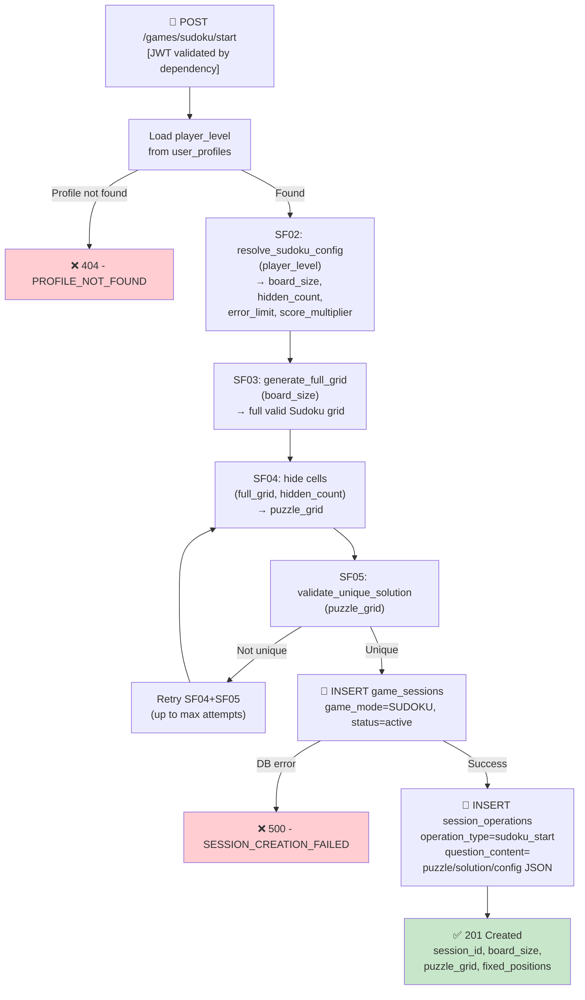

## 📝 Change History
| Date | Version | Changes | Status |
|------|---------|---------|--------|
| 2026-05-20 | 1.0.0 | Initial design draft | 📝 Draft |

# G02_F05_SF01: Initialize Sudoku Session

📝 MVP  
**Function**: Sudoku (G02_F05)  
**Status**: 📝 DRAFT (Not yet implemented)  
**Priority**: High (Phase 2)  
**Difficulty**: High  

---

## 📋 Description

Initialize a Sudoku game session for an authenticated player. The server loads the player's current level from `UserProfile`, delegates to SF02 to resolve board configuration (board_size, hidden_count, error_limit, score_multiplier), then calls SF03 to generate a full valid Sudoku grid, and SF04+SF05 to produce the puzzle (hide cells, verify unique solution). A `GameSession` record is created with `game_mode=SUDOKU`, and a `session_operation` of type `sudoku_start` is persisted, storing the full puzzle state (puzzle_grid, solution_grid, fixed_positions, board_size, hidden_count, score_multiplier, error_limit) as JSON. The client receives the puzzle grid (0 represents hidden cells), the session ID, board size, and fixed cell positions.

---

## 🎯 Detailed Requirements

### Input Parameters

**Request Body**: None (empty body or omit)

**Headers**
```
Authorization: Bearer <access_token>
```

**Validation Rules**
- No request body parameters required
- Valid JWT token required; `user_id` is extracted from token via `get_current_user_id()` dependency
- A `UserProfile` record must exist for the authenticated user

### Output Schemas

**Success Response (201 Created)**
```json
{
  "success": true,
  "data": {
    "session_id": "550e8400-e29b-41d4-a716-446655440000",
    "board_size": 9,
    "puzzle_grid": [
      [5, 3, 0, 0, 7, 0, 0, 0, 0],
      [6, 0, 0, 1, 9, 5, 0, 0, 0],
      [0, 9, 8, 0, 0, 0, 0, 6, 0],
      [8, 0, 0, 0, 6, 0, 0, 0, 3],
      [4, 0, 0, 8, 0, 3, 0, 0, 1],
      [7, 0, 0, 0, 2, 0, 0, 0, 6],
      [0, 6, 0, 0, 0, 0, 2, 8, 0],
      [0, 0, 0, 4, 1, 9, 0, 0, 5],
      [0, 0, 0, 0, 8, 0, 0, 7, 9]
    ],
    "fixed_positions": [
      {"row": 0, "col": 0},
      {"row": 0, "col": 1},
      {"row": 0, "col": 4}
    ]
  },
  "error": null
}
```

**Notes**:
- `puzzle_grid`: 2D array of integers; `0` represents a hidden (blank) cell; non-zero values are fixed (pre-filled) cells
- `fixed_positions`: list of `{row, col}` objects identifying cells that the player cannot modify
- `board_size`: one of `4`, `6`, or `9`

**Error Responses**
```json
{
  "success": false,
  "data": null,
  "error": {
    "code": "PROFILE_NOT_FOUND",
    "message": "User profile not found"
  }
}
```

Error codes: `PROFILE_NOT_FOUND` (404), `SESSION_CREATION_FAILED` (500), `UNAUTHORIZED` (401)

---

## 🗏️ Business Logic (7 Steps)

**Precondition**: User is authenticated — Bearer token validated via FastAPI `get_current_user_id()` dependency before this function executes.

1. **Load Player Level** - Query `user_profiles` for the authenticated `user_id`; extract `current_level` (integer); raise `PROFILE_NOT_FOUND (404)` if no profile exists
2. **Resolve Board Config (SF02)** - Call `resolve_sudoku_config(player_level)` to obtain `board_size`, `hidden_count`, `error_limit`, `score_multiplier` based on the player's level range
3. **Generate Full Grid (SF03)** - Call `generate_full_grid(board_size)` to produce a complete, valid Sudoku grid satisfying all row/column/block constraints; block shapes are 2×2 for 4×4, 2×3 for 6×6, 3×3 for 9×9
4. **Generate Puzzle (SF04 + SF05)** - Call `generate_puzzle(full_grid, hidden_count)` which removes exactly `hidden_count` cells (SF04) and then calls `validate_unique_solution(puzzle_grid)` (SF05) to verify the puzzle has exactly one valid solution; retry if uniqueness fails (up to a fixed attempt limit)
5. **Create GameSession Record** - INSERT into `game_sessions` with `game_mode=GameMode.SUDOKU`, `status="active"`, `user_id`, `level_player_at_start=player_level`; raise `SESSION_CREATION_FAILED (500)` on DB error
6. **Create session_operation Record** - INSERT into `session_operations` with `operation_type="sudoku_start"`, `session_id` from step 5, and `question_content` (JSON) containing: `puzzle_grid`, `solution_grid` (full grid from step 3), `fixed_positions` (list of non-zero cell coordinates in puzzle_grid), `board_size`, `hidden_count`, `score_multiplier`, `error_limit`; `question_correct_answer=null`, `user_answer=null`
7. **Return Puzzle to Client** - HTTP 201 with `session_id`, `board_size`, `puzzle_grid` (0 for hidden cells), `fixed_positions`

---

## 🔄 Flow Diagram



---

## 💻 Backend Implementation

**Status**: 📝 NOT YET IMPLEMENTED  
**Location**: `app/api/v1/games/sudoku.py`, `app/services/sudoku_service.py`, `app/schemas/sudoku.py`  
**Tests**: `tests/test_sudoku.py`

### Architecture Overview

| Component | Purpose | Details |
|-----------|---------|---------|
| **API Router** | HTTP endpoint | POST `/api/v1/games/sudoku/start` — no request body, auth required |
| **Service Layer** | Business logic | Orchestrates SF02–SF05, creates GameSession and session_operation |
| **Pydantic Schemas** | Response validation | `SudokuStartResponse` with session_id, board_size, puzzle_grid, fixed_positions |
| **Database Models** | Persistence | `game_sessions` (game_mode=SUDOKU), `session_operations` (operation_type=sudoku_start) |
| **sudoku_service.py** | Core logic | `initialize_session()`, delegating to `resolve_sudoku_config()`, `generate_full_grid()`, `generate_puzzle()` |

### Implementation Highlights

⬜ **Player level loading**: Query `user_profiles.current_level` for authenticated user; raise 404 if not found  
⬜ **SF02 delegation**: Call `resolve_sudoku_config(player_level)` to get board_size, hidden_count, error_limit, score_multiplier  
⬜ **Full grid generation (SF03)**: Backtracking algorithm producing a complete valid Sudoku grid  
⬜ **Puzzle generation (SF04+SF05)**: Remove `hidden_count` cells, verify unique solution; retry loop with attempt cap  
⬜ **GameSession creation**: INSERT with `game_mode=GameMode.SUDOKU`, `status="active"`, `level_player_at_start`  
⬜ **session_operation creation**: `operation_type="sudoku_start"`, `question_content` JSON stores full puzzle state including `solution_grid`  
⬜ **Fixed positions derivation**: Compute from non-zero cells in `puzzle_grid` before writing to DB  
⬜ **Async DB operations**: All queries via async SQLAlchemy session  
⬜ **Error handling**: 404 for missing profile, 500 for DB failure, structured error response format  

### Future Enhancements

- Support for resuming an in-progress Sudoku session (return existing active session with `resumed=true`)
- Difficulty hint system (reveal a cell on demand)
- Time-based challenge mode with countdown timer

---

## 📊 Security Considerations

| Area | Implementation |
|------|----------------|
| **Authentication** | Bearer token required; `user_id` extracted from JWT via `get_current_user_id()` dependency |
| **Session Isolation** | GameSession scoped to `user_id`; players cannot access or interfere with other players' sessions |
| **Solution Concealment** | `solution_grid` is stored only in `session_operations.question_content` (server-side); never returned to the client in any API response |
| **Server-controlled Config** | Board size, hidden count, error limit, and score multiplier are resolved server-side from player level; client cannot supply or override these |
| **Input Validation** | No client input beyond the JWT token; all game parameters are derived from server state |

---

## ✅ Test Coverage

### Success Cases
- [ ] `test_sudoku_start_creates_session` - Authenticated user receives session_id, puzzle_grid, board_size, fixed_positions (201)
- [ ] `test_sudoku_start_puzzle_has_correct_hidden_count` - Number of zeros in puzzle_grid equals hidden_count for the player's level config
- [ ] `test_sudoku_start_fixed_positions_match_puzzle` - Every non-zero cell in puzzle_grid has a corresponding entry in fixed_positions
- [ ] `test_sudoku_start_creates_sudoku_start_operation` - DB contains a `session_operation` with `operation_type="sudoku_start"` linked to the session
- [ ] `test_sudoku_start_solution_not_in_response` - Response does not contain `solution_grid` field
- [ ] `test_sudoku_start_board_size_matches_player_level` - Returned `board_size` matches config for the player's level range

### Error Cases
- [ ] `test_sudoku_start_unauthenticated_returns_401` - No token → 401 UNAUTHORIZED
- [ ] `test_sudoku_start_missing_profile_returns_404` - User without UserProfile → 404 PROFILE_NOT_FOUND

---

## 🚀 API Endpoint

**POST** `/api/v1/games/sudoku/start`

**Request Headers**
```
Authorization: Bearer <access_token>
```

**Request Body**: None

**Response Example — Success (201)**
```json
{
  "success": true,
  "data": {
    "session_id": "550e8400-e29b-41d4-a716-446655440000",
    "board_size": 9,
    "puzzle_grid": [
      [5, 3, 0, 0, 7, 0, 0, 0, 0],
      [6, 0, 0, 1, 9, 5, 0, 0, 0],
      [0, 9, 8, 0, 0, 0, 0, 6, 0],
      [8, 0, 0, 0, 6, 0, 0, 0, 3],
      [4, 0, 0, 8, 0, 3, 0, 0, 1],
      [7, 0, 0, 0, 2, 0, 0, 0, 6],
      [0, 6, 0, 0, 0, 0, 2, 8, 0],
      [0, 0, 0, 4, 1, 9, 0, 0, 5],
      [0, 0, 0, 0, 8, 0, 0, 7, 9]
    ],
    "fixed_positions": [
      {"row": 0, "col": 0},
      {"row": 0, "col": 1},
      {"row": 0, "col": 4}
    ]
  },
  "error": null
}
```

**Response Example — Profile Not Found (404)**
```json
{
  "success": false,
  "data": null,
  "error": {
    "code": "PROFILE_NOT_FOUND",
    "message": "User profile not found"
  }
}
```

**Response Example — Unauthenticated (401)**
```json
{
  "success": false,
  "data": null,
  "error": {
    "code": "UNAUTHORIZED",
    "message": "Authentication required"
  }
}
```

**Response Example — Server Error (500)**
```json
{
  "success": false,
  "data": null,
  "error": {
    "code": "SESSION_CREATION_FAILED",
    "message": "Failed to create game session"
  }
}
```

---

## 📋 Implementation Checklist

- [ ] Add `operation_type` column to `session_operations` model and Alembic migration
- [ ] Change `question_correct_answer` column type from BIGINT to JSON in `session_operations`
- [ ] Change `user_answer` column type from INT to JSON in `session_operations`
- [ ] Add `GameMode.SUDOKU` to the `GameMode` enum
- [ ] Implement `resolve_sudoku_config(player_level)` in `sudoku_service.py` (SF02)
- [ ] Implement `generate_full_grid(board_size)` in `sudoku_service.py` (SF03)
- [ ] Implement `generate_puzzle(full_grid, hidden_count)` in `sudoku_service.py` (SF04)
- [ ] Implement `validate_unique_solution(puzzle_grid)` in `sudoku_service.py` (SF05)
- [ ] Implement `initialize_session(user_id, db)` in `sudoku_service.py`
- [ ] Define `SudokuStartResponse` Pydantic schema in `app/schemas/sudoku.py`
- [ ] Create API router `app/api/v1/games/sudoku.py` with POST `/start` endpoint
- [ ] Register sudoku router in `app/main.py`
- [ ] Write test suite in `tests/test_sudoku.py`
- [ ] Validate solution_grid is never returned in any API response

---

## 🔗 Related Documentation

- **Database Models**: `app/models/game_session.py`, `app/models/session_operation.py`
- **Service Logic**: `app/services/sudoku_service.py`
- **Pydantic Schemas**: `app/schemas/sudoku.py`
- **API Router**: `app/api/v1/games/sudoku.py`
- **Test Suite**: `tests/test_sudoku.py`
- **Related Specs**: [G02_F05_SF02](G02_F05_SF02.md) (Resolve Config), [G02_F05_SF03](G02_F05_SF03.md) (Generate Full Grid), [G02_F05_SF04](G02_F05_SF04.md) (Generate Puzzle)

---

**Last Updated**: 2026-05-20  
**Implementation Status**: 📝 DRAFT  
**Test Status**: 📝 NOT WRITTEN
