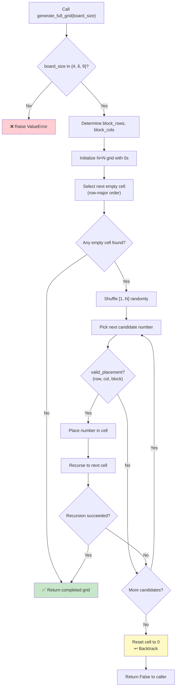

## 📝 Change History
| Date | Version | Changes | Status |
|------|---------|---------|--------|
| 2026-05-20 | 1.0.0 | Initial creation — spec drafted for full Sudoku grid generation utility | 📝 Draft |

# G02_F05_SF03: Generate Full Sudoku Grid

📝 Draft  
**Function**: Sudoku Game — Grid & Puzzle Generation (G02_F05)  
**Status**: ⬜ NOT IMPLEMENTED  
**Priority**: High (Phase 1 — prerequisite for SF04)  
**Difficulty**: Medium  

---

## 📋 Description

Generate a complete, valid Sudoku grid of a given board size using backtracking with randomized number ordering. A valid grid guarantees that every row, column, and block contains each number from 1 to N exactly once. Supported board sizes are 4×4 (2×2 blocks), 6×6 (2×3 blocks), and 9×9 (3×3 blocks). This is a pure Python utility function with no API endpoint and no database interaction.

---

## 🎯 Detailed Requirements

### Input Parameters

| Parameter | Type | Required | Constraints | Description |
|-----------|------|----------|-------------|-------------|
| `board_size` | `int` | Yes | One of `4`, `6`, `9` | Dimension of the square grid |

### Validation Rules

- `board_size` must be one of the three supported values: `4`, `6`, or `9`.
- Any other value must raise a `ValueError` with a descriptive message before generation begins.

### Output Schemas

**Return value**: `list[list[int]]`

A fully filled N×N grid (N = board_size) where each integer is in the range `[1, N]`.

**Example — 4×4 completed grid**
```python
[
  [1, 2, 3, 4],
  [3, 4, 1, 2],
  [2, 1, 4, 3],
  [4, 3, 2, 1]
]
```

**Error cases**

| Condition | Raised exception | Message |
|-----------|-----------------|---------|
| Unsupported `board_size` | `ValueError` | `"board_size must be 4, 6, or 9"` |

---

## 🗏️ Business Logic (5 Steps)

1. **Validate board_size** — Accept only `4`, `6`, or `9`; raise `ValueError` for any other input.

2. **Determine block dimensions** — Map board_size to `(block_rows, block_cols)`:
   - `4` → `(2, 2)`
   - `6` → `(2, 3)`
   - `9` → `(3, 3)`

3. **Initialize empty grid** — Create an N×N list of lists filled entirely with `0`.

4. **Fill cells via backtracking** — Traverse cells in row-major order (left-to-right, top-to-bottom):
   a. Shuffle the list `[1, 2, ..., N]` using a random permutation to ensure each generated grid is unique.
   b. For each candidate number, call `valid_placement(grid, row, col, num, block_rows, block_cols)`:
      - **Row check**: number must not already exist in `grid[row]`.
      - **Column check**: number must not already exist in `grid[r][col]` for all rows `r`.
      - **Block check**: compute block origin `(block_rows * (row // block_rows), block_cols * (col // block_cols))` and confirm the number is absent from all cells in that block.
   c. If placement is valid: assign `grid[row][col] = num` and recurse to the next cell.
   d. If recursion succeeds: propagate success upward.
   e. If no candidate number leads to a solution: reset `grid[row][col] = 0` and return `False` (backtrack).

5. **Return completed grid** — When backtracking reaches a state with no empty cells left, the grid is complete; return it as `list[list[int]]`.

---

## 🔄 Flow Diagram



---

## 💻 Backend Implementation

**Status**: ⬜ NOT IMPLEMENTED  
**Location**: `app/utils/sudoku_generator.py`  
**Tests**: Not yet written

### Architecture Overview

| Component | Purpose | Details |
|-----------|---------|---------|
| **`generate_full_grid(board_size)`** | Entry point | Validates input, initializes grid, triggers backtracking |
| **`_fill_grid(grid, board_size, block_rows, block_cols)`** | Recursive backtracker | Fills cells in row-major order with shuffled candidates |
| **`valid_placement(grid, row, col, num, block_rows, block_cols)`** | Constraint checker | Validates row, column, and block uniqueness |
| **Block dimension map** | Config lookup | Maps `board_size` to `(block_rows, block_cols)` |

### Implementation Highlights

⬜ **Grid initialization**: Create N×N list of lists pre-filled with `0` for a given `board_size`  
⬜ **Block dimension mapping**: Lookup table for `4→(2,2)`, `6→(2,3)`, `9→(3,3)`  
⬜ **Randomized backtracking**: Shuffle `[1..N]` before trying candidates to ensure varied output  
⬜ **Row/column/block validity check**: Single helper `valid_placement` used by both generator and solver  
⬜ **Input validation**: Raise `ValueError` for unsupported `board_size` before any work  
⬜ **Unit tests**: Verify grid completeness, uniqueness per row/column/block, all three board sizes  

### Future Enhancements

- Support custom board sizes if the game expands beyond 4/6/9.
- Optionally accept a random seed for reproducible test grids.
- Expose generation time metrics for performance monitoring.

---

## 📊 Security Considerations

| Area | Implementation |
|------|----------------|
| **Input validation** | `board_size` restricted to an explicit allowlist `{4, 6, 9}` — no arbitrary sizes accepted |
| **No external input in grid logic** | Backtracking operates only on internally controlled data; no user-supplied cell values influence generation |
| **No database interaction** | Pure in-memory computation; no SQL injection surface |
| **No secrets or PII** | Function handles only integers; no user data involved |

---

## ✅ Test Coverage

### Planned Test Cases

| Test | Description | Expected Result |
|------|-------------|-----------------|
| `test_generate_4x4_grid_complete` | Generate a 4×4 grid and verify all 16 cells are non-zero | All cells in `[1, 4]` |
| `test_generate_6x6_grid_complete` | Generate a 6×6 grid and verify all 36 cells are non-zero | All cells in `[1, 6]` |
| `test_generate_9x9_grid_complete` | Generate a 9×9 grid and verify all 81 cells are non-zero | All cells in `[1, 9]` |
| `test_grid_rows_unique` | Verify no row contains duplicate numbers (all three sizes) | Each row is a permutation of `[1..N]` |
| `test_grid_cols_unique` | Verify no column contains duplicate numbers | Each column is a permutation of `[1..N]` |
| `test_grid_blocks_unique` | Verify no block contains duplicate numbers | Each block is a permutation of `[1..N]` |
| `test_generate_invalid_board_size` | Call with `board_size=5` | `ValueError` raised |
| `test_generate_randomness` | Call twice; grids should differ (statistically) | Two grids are not identical |

---

## 🚀 API Endpoint

This sub-function has no direct API endpoint. It is called internally.

---

## 📋 Implementation Checklist

- [ ] Create `app/utils/sudoku_generator.py` module
- [ ] Implement `valid_placement(grid, row, col, num, block_rows, block_cols)` helper
- [ ] Implement `_fill_grid(grid, board_size, block_rows, block_cols)` recursive backtracker
- [ ] Implement `generate_full_grid(board_size)` public entry point with input validation
- [ ] Add block dimension lookup table for sizes 4, 6, 9
- [ ] Write unit tests covering all three board sizes
- [ ] Verify row, column, and block uniqueness in tests
- [ ] Verify `ValueError` raised for unsupported `board_size`
- [ ] Add Google-style docstrings to all public functions
- [ ] Confirm no `print()` calls — use `logging.getLogger(__name__)`
- [ ] Run `black` and `flake8` on the new file

---

## 🔗 Related Documentation

- **Utility Module**: `app/utils/sudoku_generator.py`
- **Test Suite**: `tests/test_sudoku_generator.py`
- **Related Specs**: G02_F05_SF01, G02_F05_SF04, G02_F05_SF05

---

**Last Updated**: 2026-05-20  
**Implementation Status**: ⬜ NOT IMPLEMENTED  
**Test Status**: ⬜ NOT WRITTEN
