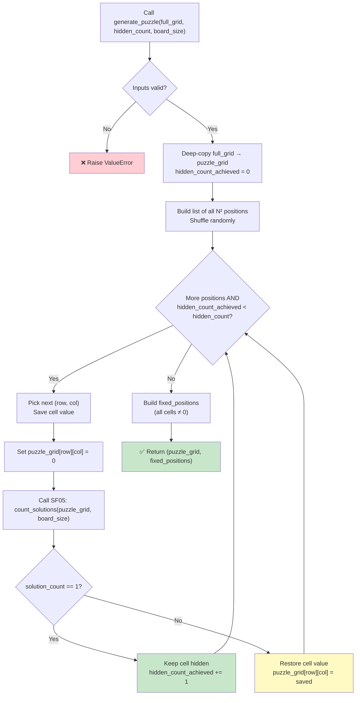

## 📝 Change History
| Date | Version | Changes | Status |
|------|---------|---------|--------|
| 2026-05-20 | 1.0.0 | Initial creation — spec drafted for Sudoku puzzle generation by difficulty level | 📝 Draft |

# G02_F05_SF04: Generate Sudoku Puzzle By Level

📝 Draft  
**Function**: Sudoku Game — Grid & Puzzle Generation (G02_F05)  
**Status**: ⬜ NOT IMPLEMENTED  
**Priority**: High (Phase 1 — depends on SF03 and SF05)  
**Difficulty**: Medium-High  

---

## 📋 Description

Create a playable Sudoku puzzle by systematically hiding cells from a completed grid produced by SF03. The number of cells to hide (`hidden_count`) is determined by the board configuration from SF02. Each removal is validated by calling SF05 (unique-solution checker) before it is accepted. If removing a cell would result in multiple solutions or no solution, the cell is restored and the algorithm moves to the next candidate. The process continues until the target `hidden_count` is achieved. This is a pure Python utility function with no API endpoint and no database interaction.

---

## 🎯 Detailed Requirements

### Input Parameters

| Parameter | Type | Required | Constraints | Description |
|-----------|------|----------|-------------|-------------|
| `full_grid` | `list[list[int]]` | Yes | N×N, all cells non-zero | Completed grid produced by SF03 |
| `hidden_count` | `int` | Yes | `1 ≤ hidden_count < N²` | Number of cells to hide (from SF02 board config) |
| `board_size` | `int` | Yes | One of `4`, `6`, `9` | Dimension of the grid; needed to call SF05 |

### Validation Rules

- `full_grid` must be a square N×N list of lists where N equals `board_size`.
- All cells in `full_grid` must be non-zero integers in `[1, N]`.
- `hidden_count` must be a positive integer strictly less than N² (at least one cell must remain visible).
- `board_size` must be one of `4`, `6`, `9`.
- If validation fails, raise `ValueError` with a descriptive message.

### Output Schemas

**Return value**: `tuple[list[list[int]], list[dict]]`

| Field | Type | Description |
|-------|------|-------------|
| `puzzle_grid` | `list[list[int]]` | N×N grid with hidden cells set to `0` |
| `fixed_positions` | `list[dict]` | List of `{"row": int, "col": int}` for every non-hidden cell |

**Example — 4×4 puzzle (hidden_count = 6)**
```python
puzzle_grid = [
  [0, 2, 0, 4],
  [3, 0, 1, 0],
  [0, 1, 4, 0],
  [4, 0, 2, 0]
]

fixed_positions = [
  {"row": 0, "col": 1},  # value 2
  {"row": 0, "col": 3},  # value 4
  {"row": 1, "col": 0},  # value 3
  {"row": 1, "col": 2},  # value 1
  {"row": 2, "col": 1},  # value 1
  {"row": 2, "col": 2},  # value 4
  {"row": 3, "col": 0},  # value 4
  {"row": 3, "col": 2},  # value 2
  {"row": 3, "col": 3},  # value 0 — wait, hidden
]
```

**Error cases**

| Condition | Raised exception | Message |
|-----------|-----------------|---------|
| `full_grid` shape mismatch | `ValueError` | `"full_grid must be a {board_size}×{board_size} grid"` |
| Cell value out of range | `ValueError` | `"All cells in full_grid must be integers in [1, N]"` |
| `hidden_count` out of range | `ValueError` | `"hidden_count must be between 1 and {N*N - 1}"` |
| Unsupported `board_size` | `ValueError` | `"board_size must be 4, 6, or 9"` |

---

## 🗏️ Business Logic (6 Steps)

1. **Validate inputs** — Check `board_size`, `full_grid` shape and cell values, and `hidden_count` range; raise `ValueError` on any violation.

2. **Deep-copy the grid** — Work on a mutable copy of `full_grid` to avoid mutating the caller's data. Initialize `hidden_count_achieved = 0`.

3. **Build and shuffle candidate positions** — Create a list of all N² cell positions `(row, col)` and shuffle it randomly. This randomness determines which cells are offered for hiding.

4. **Iterate through candidate positions** — For each `(row, col)` in the shuffled list:
   a. If `hidden_count_achieved == hidden_count`: stop iteration immediately.
   b. Save the current cell value: `saved = puzzle_grid[row][col]`.
   c. Set `puzzle_grid[row][col] = 0`.
   d. Call SF05: `solution_count = count_solutions(puzzle_grid, board_size)`.
   e. If `solution_count == 1`: the puzzle remains uniquely solvable — keep the cell hidden and increment `hidden_count_achieved`.
   f. If `solution_count != 1`: restore the cell — `puzzle_grid[row][col] = saved`.

5. **Build fixed_positions** — Scan the final `puzzle_grid`; for every cell with a value `!= 0`, append `{"row": row, "col": col}` to `fixed_positions`.

6. **Return results** — Return `(puzzle_grid, fixed_positions)` as a tuple.

---

## 🔄 Flow Diagram



---

## 💻 Backend Implementation

**Status**: ⬜ NOT IMPLEMENTED  
**Location**: `app/utils/sudoku_generator.py`  
**Tests**: Not yet written

### Architecture Overview

| Component | Purpose | Details |
|-----------|---------|---------|
| **`generate_puzzle(full_grid, hidden_count, board_size)`** | Public entry point | Validates inputs, drives the hide-and-check loop, returns puzzle + fixed cells |
| **SF05 (`count_solutions`)** | Unique-solution verifier | Called on each candidate removal; early-exits at count 2 |
| **SF03 (`generate_full_grid`)** | Grid source | Produces the `full_grid` passed into this function |
| **SF02 board config** | `hidden_count` source | Provides the number of cells to hide per difficulty level |

### Implementation Highlights

⬜ **Input validation**: Enforce grid shape, cell value range, `hidden_count` bounds, and `board_size` allowlist  
⬜ **Deep copy**: Avoid mutating the original completed grid passed by the caller  
⬜ **Randomized removal order**: Shuffle all N² positions before iterating to produce varied puzzles at the same difficulty  
⬜ **Unique-solution guard**: Call SF05 after each removal; restore the cell immediately if uniqueness is violated  
⬜ **Early stop**: Halt the loop as soon as `hidden_count_achieved == hidden_count`  
⬜ **fixed_positions construction**: Scan final puzzle grid and collect non-zero cell coordinates  
⬜ **Unit tests**: Cover happy path (all three sizes), unreachable hidden_count, and puzzle uniqueness verification  

### Future Enhancements

- Support a configurable maximum attempts limit to handle edge cases where `hidden_count` cannot be fully achieved.
- Return the number of cells actually hidden alongside `fixed_positions` for transparency.
- Cache generated puzzles by difficulty tier to reduce on-demand computation time.

---

## 📊 Security Considerations

| Area | Implementation |
|------|----------------|
| **Input validation** | All parameters validated before any computation; no arbitrary grid shapes or sizes accepted |
| **Immutability of original grid** | Deep copy ensures caller's `full_grid` is never modified |
| **No user-supplied cell values** | The function only receives a machine-generated grid; no path for injection |
| **No database interaction** | Pure in-memory computation; no SQL surface |
| **Determinism control** | Randomness is isolated to position shuffle; no global state mutation |

---

## ✅ Test Coverage

### Planned Test Cases

| Test | Description | Expected Result |
|------|-------------|-----------------|
| `test_puzzle_4x4_hidden_count` | Generate 4×4 puzzle with `hidden_count=6`; count zeros in result | Exactly 6 zeros in `puzzle_grid` |
| `test_puzzle_6x6_hidden_count` | Generate 6×6 puzzle with `hidden_count=12` | Exactly 12 zeros |
| `test_puzzle_9x9_hidden_count` | Generate 9×9 puzzle with `hidden_count=40` | Exactly 40 zeros |
| `test_puzzle_unique_solution` | Pass result to SF05; verify count == 1 | `count_solutions` returns `1` |
| `test_fixed_positions_correct` | Verify `fixed_positions` contains only non-zero cells | All listed positions have non-zero values in `puzzle_grid` |
| `test_fixed_positions_count` | Count of `fixed_positions` equals N² − hidden_count | `len(fixed_positions) == N*N - hidden_count` |
| `test_full_grid_not_mutated` | Original `full_grid` unchanged after call | `full_grid` equals input after `generate_puzzle` returns |
| `test_invalid_hidden_count_zero` | Call with `hidden_count=0` | `ValueError` raised |
| `test_invalid_hidden_count_too_large` | Call with `hidden_count=N*N` | `ValueError` raised |
| `test_invalid_board_size` | Call with `board_size=8` | `ValueError` raised |
| `test_puzzle_randomness` | Call twice with same grid; puzzles differ (statistically) | Two `puzzle_grid` results are not identical |

---

## 🚀 API Endpoint

This sub-function has no direct API endpoint. It is called internally.

---

## 📋 Implementation Checklist

- [ ] Implement `generate_puzzle(full_grid, hidden_count, board_size)` in `app/utils/sudoku_generator.py`
- [ ] Add input validation for `board_size`, grid shape, cell values, and `hidden_count`
- [ ] Deep-copy `full_grid` before any modification
- [ ] Implement randomized position shuffle for removal order
- [ ] Integrate call to SF05 `count_solutions` after each candidate removal
- [ ] Implement cell restore logic when `count_solutions != 1`
- [ ] Build `fixed_positions` from final puzzle grid
- [ ] Return `(puzzle_grid, fixed_positions)` tuple
- [ ] Write unit tests for all three board sizes
- [ ] Verify original grid is not mutated in tests
- [ ] Verify returned puzzle has exactly `hidden_count` zeros
- [ ] Verify puzzle has a unique solution via SF05 in tests
- [ ] Add Google-style docstrings to all public functions
- [ ] Confirm no `print()` calls — use `logging.getLogger(__name__)`
- [ ] Run `black` and `flake8` on the updated file

---

## 🔗 Related Documentation

- **Utility Module**: `app/utils/sudoku_generator.py`
- **Test Suite**: `tests/test_sudoku_generator.py`
- **Related Specs**: G02_F05_SF01, G02_F05_SF02, G02_F05_SF03, G02_F05_SF05

---

**Last Updated**: 2026-05-20  
**Implementation Status**: ⬜ NOT IMPLEMENTED  
**Test Status**: ⬜ NOT WRITTEN
