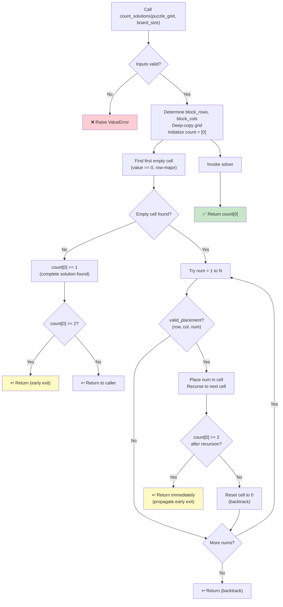

## 📝 Change History
| Date | Version | Changes | Status |
|------|---------|---------|--------|
| 2026-05-20 | 1.0.0 | Initial creation — spec drafted for Sudoku unique-solution validation utility | 📝 Draft |

# G02_F05_SF05: Validate Unique Solution

📝 Draft  
**Function**: Sudoku Game — Grid & Puzzle Generation (G02_F05)  
**Status**: ⬜ NOT IMPLEMENTED  
**Priority**: High (Phase 1 — called by SF04 on every candidate removal)  
**Difficulty**: Medium  

---

## 📋 Description

Verify that a Sudoku puzzle grid has exactly one valid solution by running a constrained backtracking solver. To avoid unnecessary work, the solver counts solutions only up to a maximum of 2 — as soon as the counter reaches 2 the function exits immediately (early-exit optimization). The return value is an integer: `0` means no solution exists, `1` means exactly one unique solution exists, and `2` means multiple solutions exist. This function is the correctness gate used by SF04 during puzzle generation; every candidate cell removal passes through it before being accepted. This is a pure Python utility with no API endpoint and no database interaction.

---

## 🎯 Detailed Requirements

### Input Parameters

| Parameter | Type | Required | Constraints | Description |
|-----------|------|----------|-------------|-------------|
| `puzzle_grid` | `list[list[int]]` | Yes | N×N, cells are integers; `0` denotes empty | Puzzle grid to validate (may contain zeros) |
| `board_size` | `int` | Yes | One of `4`, `6`, `9` | Dimension of the grid; determines N and block shape |

### Validation Rules

- `board_size` must be one of `4`, `6`, `9`; raise `ValueError` otherwise.
- `puzzle_grid` must be an N×N list of lists where N equals `board_size`.
- Each cell must be an integer in `[0, N]`; `0` represents an empty cell.
- The function operates on a deep copy of `puzzle_grid` to avoid mutating the caller's data.

### Output Schemas

**Return value**: `int`

| Return value | Meaning |
|-------------|---------|
| `0` | No valid solution exists for this puzzle |
| `1` | Exactly one unique solution exists |
| `2` | Two or more solutions exist (early exit; exact count beyond 2 is not computed) |

**Example usage by SF04**
```python
count = count_solutions(puzzle_grid, board_size=9)
if count == 1:
    # Accept the removal — puzzle remains uniquely solvable
    hidden_count_achieved += 1
else:
    # Reject the removal — restore the cell
    puzzle_grid[row][col] = saved_value
```

**Error cases**

| Condition | Raised exception | Message |
|-----------|-----------------|---------|
| Unsupported `board_size` | `ValueError` | `"board_size must be 4, 6, or 9"` |
| `puzzle_grid` shape mismatch | `ValueError` | `"puzzle_grid must be a {board_size}×{board_size} grid"` |
| Cell value out of range | `ValueError` | `"All cells must be integers in [0, N]"` |

---

## 🗏️ Business Logic (4 Steps)

1. **Validate inputs** — Confirm `board_size` is in `{4, 6, 9}`, `puzzle_grid` is N×N, and all cell values are in `[0, N]`. Raise `ValueError` for any violation. Determine `block_rows` and `block_cols` from `board_size`.

2. **Deep-copy the grid** — Operate on a mutable copy so the caller's puzzle is never modified during the solving process.

3. **Run backtracking solver with counter** — Use a mutable counter (e.g., a single-element list `[0]` to allow mutation inside a nested function) and apply the following recursive procedure:
   a. **Find the first empty cell** — Scan cells in row-major order for the first cell where `grid[row][col] == 0`.
   b. **Base case — no empty cell found**: A complete, valid solution has been reached. Increment the counter: `count[0] += 1`. If `count[0] >= 2`, return immediately (early exit — further enumeration is unnecessary).
   c. **Recursive case — empty cell found**: Try each number `num` in `[1, N]`:
      - Call `valid_placement(grid, row, col, num, block_rows, block_cols)` (shared helper from SF03).
      - If valid: assign `grid[row][col] = num` and recurse.
      - After recursion: if `count[0] >= 2`, return immediately (propagate early exit upward through all stack frames).
      - Backtrack: reset `grid[row][col] = 0`.

4. **Return final count** — After the recursive solver completes, return `count[0]`. Possible values: `0` (unsolvable), `1` (unique), `2` (multiple solutions detected).

---

## 🔄 Flow Diagram



---

## 💻 Backend Implementation

**Status**: ⬜ NOT IMPLEMENTED  
**Location**: `app/utils/sudoku_generator.py`  
**Tests**: Not yet written

### Architecture Overview

| Component | Purpose | Details |
|-----------|---------|---------|
| **`count_solutions(puzzle_grid, board_size)`** | Public entry point | Validates input, copies grid, invokes solver, returns count |
| **`_solve_count(grid, board_size, block_rows, block_cols, count)`** | Recursive solver | Backtracking with shared mutable counter and early exit at count 2 |
| **`valid_placement(grid, row, col, num, block_rows, block_cols)`** | Shared constraint checker | Reused from SF03; validates row, column, and block uniqueness |
| **Mutable counter** | Solution accumulator | Single-element list `[0]` passed by reference to allow mutation inside nested recursion |

### Implementation Highlights

⬜ **Input validation**: Enforce `board_size` allowlist, grid shape, and cell value range before solver runs  
⬜ **Deep copy**: Ensure the caller's `puzzle_grid` is never modified during solving  
⬜ **Early exit at count 2**: As soon as a second solution is found, all recursive frames return immediately without further exploration  
⬜ **Mutable counter via list**: Use `count = [0]` pattern (or `nonlocal` variable) to share state across recursive calls in Python  
⬜ **Shared `valid_placement` helper**: Reuse the same constraint checker defined for SF03 — no duplication  
⬜ **Unit tests**: Cover unique solution (returns 1), no solution (returns 0), multiple solutions (returns 2), all three board sizes  

### Future Enhancements

- Accept an optional `max_solutions` parameter to make the early-exit threshold configurable.
- Return the actual solution grid when `count == 1` to avoid running the solver twice in callers that need the solution.
- Add performance benchmarks for 9×9 worst-case inputs.

---

## 📊 Security Considerations

| Area | Implementation |
|------|----------------|
| **Input validation** | Strict type and range checks before any recursion; no arbitrary grid shapes accepted |
| **Immutability of caller data** | Deep copy prevents the solver's backtracking from corrupting the puzzle passed by SF04 |
| **No external input in solver logic** | All numbers tried by the solver are generated internally in `[1, N]`; no user-supplied candidates |
| **No database interaction** | Pure in-memory computation; zero SQL surface |
| **Bounded execution** | Early exit at count 2 prevents exhaustive enumeration; worst case is bounded by the standard Sudoku search space |

---

## ✅ Test Coverage

### Planned Test Cases

| Test | Description | Expected Result |
|------|-------------|-----------------|
| `test_count_unique_solution_4x4` | Provide a valid 4×4 puzzle with one solution | Returns `1` |
| `test_count_unique_solution_6x6` | Provide a valid 6×6 puzzle with one solution | Returns `1` |
| `test_count_unique_solution_9x9` | Provide a valid 9×9 puzzle with one solution | Returns `1` |
| `test_count_multiple_solutions` | Provide a puzzle with two or more solutions | Returns `2` |
| `test_count_no_solution` | Provide an unsolvable puzzle (conflicting constraints) | Returns `0` |
| `test_count_fully_filled_grid` | Provide a complete grid with no empty cells | Returns `1` |
| `test_puzzle_grid_not_mutated` | Verify caller's `puzzle_grid` is unchanged after call | Input grid equals original after `count_solutions` returns |
| `test_early_exit_performance` | Puzzle with many solutions should return quickly | `count_solutions` returns `2` without exhaustive search |
| `test_invalid_board_size` | Call with `board_size=7` | `ValueError` raised |
| `test_invalid_cell_value` | Grid contains cell value `10` in a 9×9 grid | `ValueError` raised |
| `test_invalid_grid_shape` | Pass a 9×8 grid with `board_size=9` | `ValueError` raised |

---

## 🚀 API Endpoint

This sub-function has no direct API endpoint. It is called internally.

---

## 📋 Implementation Checklist

- [ ] Implement `count_solutions(puzzle_grid, board_size)` in `app/utils/sudoku_generator.py`
- [ ] Add input validation for `board_size`, grid shape, and cell value range
- [ ] Deep-copy `puzzle_grid` before passing to the internal solver
- [ ] Implement `_solve_count` recursive solver with mutable counter
- [ ] Add early exit: return immediately when `count[0] >= 2`
- [ ] Propagate early exit upward through all recursive frames
- [ ] Reuse `valid_placement` helper from SF03 — no duplication
- [ ] Return final `count[0]` from the public entry point
- [ ] Write unit tests for unique, no-solution, and multiple-solution cases
- [ ] Write tests for all three board sizes
- [ ] Verify caller's grid is not mutated in tests
- [ ] Add Google-style docstrings to all public functions
- [ ] Confirm no `print()` calls — use `logging.getLogger(__name__)`
- [ ] Run `black` and `flake8` on the updated file

---

## 🔗 Related Documentation

- **Utility Module**: `app/utils/sudoku_generator.py`
- **Test Suite**: `tests/test_sudoku_generator.py`
- **Related Specs**: G02_F05_SF03, G02_F05_SF04

---

**Last Updated**: 2026-05-20  
**Implementation Status**: ⬜ NOT IMPLEMENTED  
**Test Status**: ⬜ NOT WRITTEN
