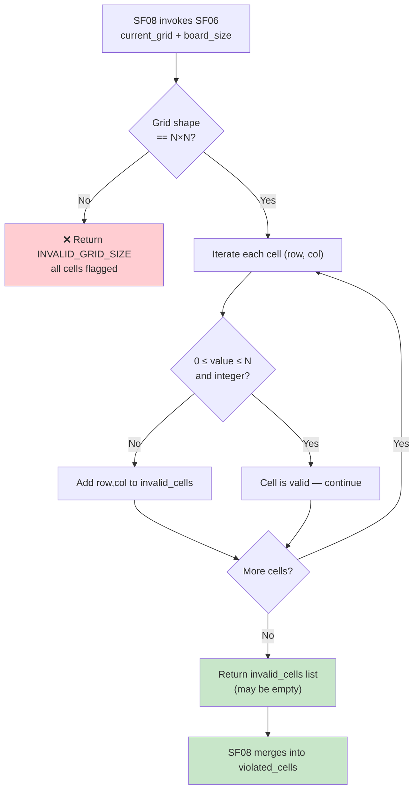

## 📝 Change History
| Date | Version | Changes | Status |
|------|---------|---------|--------|
| 2026-05-20 | 1.0.0 | Initial design | 📝 Draft |

# G02_F05_SF06: Capture Single Number Input

📝 MVP  
**Function**: Sudoku (G02_F05)  
**Status**: 📝 PLANNED  
**Priority**: High (Phase 2)  
**Difficulty**: Low  

---

## 📋 Description

Validates that each cell in the submitted Sudoku grid contains exactly one number in the valid range 1–N (where N = board_size), or 0 to represent an empty cell. Each cell holds at most one value. This validation runs server-side as part of the submit pipeline (SF08) — the client sends the full `current_grid` and this sub-check verifies all cell values are within the legal range before any further validation proceeds.

---

## 🎯 Detailed Requirements

### Input Parameters

This sub-function is invoked internally by SF08 and does not have a dedicated API endpoint. The inputs are extracted from the submit request.

**Internal Input**
```json
{
  "current_grid": [[5,3,0,0,7,0,0,0,0],[6,0,0,1,9,5,0,0,0]],
  "board_size": 9
}
```

**Validation Rules**
- `current_grid`: Required, N×N 2-D array of integers
- `board_size`: Required, integer — defines N (e.g., 4, 9)
- Each cell value: Integer in range `[0, N]` inclusive — `0` means empty, `1–N` means a placed digit
- Grid dimensions: Must be exactly N rows, each row exactly N columns
- Out-of-range values (negative, > N, or non-integer) are treated as invalid

### Output Schemas

**Internal Return Value**
```json
{
  "invalid_cells": [
    {"row": 2, "col": 4},
    {"row": 7, "col": 1}
  ]
}
```

Returns an empty list when all cell values are valid. This list is merged into `violated_cells` by SF08.

Error codes (surfaced by SF08): `INVALID_GRID_SIZE` (400), `INVALID_CELL_VALUE` (400)

---

## 🗏️ Business Logic (3 Steps)

**Precondition**: Invoked from within SF08 after session and grid-size checks pass.

1. **Validate Grid Dimensions** — Confirm the submitted grid has exactly N rows and each row has exactly N columns. If the shape does not match board_size × board_size → record all cells as invalid and short-circuit, returning `INVALID_GRID_SIZE` to SF08.

2. **Scan Each Cell for Valid Range** — Iterate every cell `(row, col)` in `current_grid`:
   - If `value < 0` or `value > board_size` or value is not an integer → add `{"row": row, "col": col}` to `invalid_cells`.
   - `value == 0` (empty cell) is always valid.
   - `1 ≤ value ≤ N` is always valid.

3. **Return Invalid Cell List** — Return the collected `invalid_cells` list to the SF08 pipeline. An empty list means all values passed range validation. SF08 is responsible for merging this result with violations from other checks.

---

## 🔄 Flow Diagram



---

## 💻 Backend Implementation

**Status**: 📝 PLANNED  
**Location**: `app/services/sudoku_service.py`  
**Tests**: Not yet written

### Architecture Overview

| Component | Purpose | Details |
|-----------|---------|---------|
| **Service Layer** | Validation sub-routine | `_validate_cell_values(current_grid, board_size)` called internally by SF08 |
| **No API Router** | Internal only | SF06 has no dedicated HTTP endpoint; exposed only through SF08 submit |
| **Pydantic Schemas** | Shared with SF08 | `SudokuSubmitRequest` in `app/schemas/sudoku.py` carries `current_grid` |

### Implementation Highlights

⬜ **Grid dimension check**: Verify `len(current_grid) == board_size` and each row has `board_size` columns  
⬜ **Range scan loop**: Iterate all N×N cells; collect `(row, col)` for any value outside `[0, board_size]`  
⬜ **Integer type guard**: Reject float or string values sneaking through JSON coercion  
⬜ **Early exit on dimension mismatch**: Skip per-cell scan when shape is wrong — return `INVALID_GRID_SIZE`  
⬜ **Empty list fast path**: Return immediately when invalid_cells is empty (no allocations needed)  

### Future Enhancements

- Support variable board sizes beyond 4×4 and 9×9 (e.g., 6×6 or 16×16)
- Typed grid cells to carry additional metadata (pencil marks) while keeping value validation consistent

---

## 📊 Security Considerations

| Area | Implementation |
|------|----------------|
| **Input Range** | Reject values outside `[0, N]`; prevents injection of sentinel values |
| **Grid Shape** | Strict N×N check prevents oversized payloads being iterated |
| **Type Safety** | Non-integer values rejected before range check |
| **No State Side Effects** | SF06 is a pure validation function — it only reads input, never writes to DB |

---

## ✅ Test Coverage (Planned)

### Success Cases
- [ ] `test_sf06_all_valid_values` - Grid with values 0–N only → empty invalid_cells
- [ ] `test_sf06_empty_cells_valid` - Grid full of zeros → empty invalid_cells
- [ ] `test_sf06_full_filled_valid` - Completely filled valid grid → empty invalid_cells

### Error Cases
- [ ] `test_sf06_value_too_large` - Cell value N+1 → that cell in invalid_cells
- [ ] `test_sf06_negative_value` - Cell value -1 → that cell in invalid_cells
- [ ] `test_sf06_wrong_row_count` - Grid has N-1 rows → INVALID_GRID_SIZE
- [ ] `test_sf06_wrong_col_count` - A row has N+1 columns → INVALID_GRID_SIZE
- [ ] `test_sf06_multiple_invalid_cells` - Several out-of-range values → all flagged
- [ ] `test_sf06_non_integer_value` - Float or string in cell → that cell in invalid_cells

---

## 🚀 API Endpoint

**No dedicated endpoint.** SF06 is a server-side validation sub-routine invoked from within SF08.

It is called from:

**POST** `/api/v1/games/sudoku/sessions/{session_id}/submit`

See G02_F05_SF08 for the full endpoint specification.

---

## 📋 Implementation Checklist

- [ ] `_validate_cell_values(current_grid, board_size)` helper in `sudoku_service.py`
- [ ] Grid dimension validation (N×N shape check)
- [ ] Per-cell range validation (integer, 0 ≤ value ≤ N)
- [ ] Returns `list[dict]` of `{"row": int, "col": int}` for violated cells
- [ ] Integrated into SF08 validation pipeline
- [ ] Unit tests covering dimension mismatch and out-of-range values

---

## 🔗 Related Documentation

- **Service Logic**: `app/services/sudoku_service.py`
- **Pydantic Schemas**: `app/schemas/sudoku.py`
- **Test Suite**: `tests/test_sudoku.py`
- **Related Specs**: G02_F05_SF07 (Replace Or Clear Cell Value), G02_F05_SF08 (Validate Player Move)

---

**Last Updated**: 2026-05-20  
**Implementation Status**: 📝 PLANNED  
**Test Status**: ⏳ NOT STARTED
