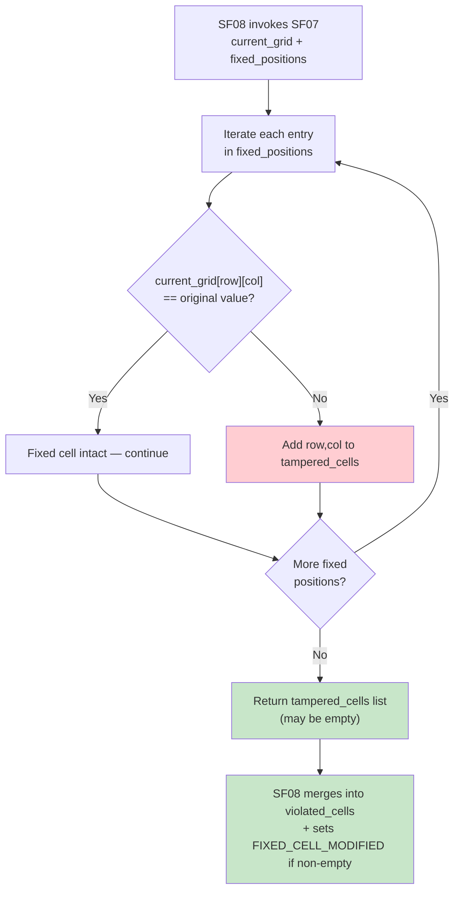

## 📝 Change History
| Date | Version | Changes | Status |
|------|---------|---------|--------|
| 2026-05-20 | 1.0.0 | Initial design | 📝 Draft |

# G02_F05_SF07: Replace Or Clear Cell Value

📝 MVP  
**Function**: Sudoku (G02_F05)  
**Status**: 📝 PLANNED  
**Priority**: High (Phase 2)  
**Difficulty**: Low  

---

## 📋 Description

Enforces the immutability rule for fixed (pre-filled) cells in the Sudoku puzzle. Fixed cells are set by the puzzle generator at session start and must not be changed or cleared by the player. The client freely updates its local `current_grid` for non-fixed cells; when the player submits, the server compares the submitted grid against `fixed_positions` loaded from the original `sudoku_start` session operation to detect any tampering. This validation is a server-side sub-routine executed as part of the SF08 submit pipeline — it has no separate API endpoint.

---

## 🎯 Detailed Requirements

### Input Parameters

SF07 is invoked internally by SF08. The inputs are extracted from the session record and the submit payload.

**Internal Input**
```json
{
  "current_grid": [[5,3,4,0,7,0,0,0,0],[6,0,0,1,9,5,0,0,0]],
  "fixed_positions": [
    {"row": 0, "col": 0, "value": 5},
    {"row": 0, "col": 1, "value": 3},
    {"row": 1, "col": 0, "value": 6}
  ]
}
```

- `current_grid`: Submitted grid from the client (N×N)
- `fixed_positions`: List of `{row, col, value}` objects loaded from the `sudoku_start` session operation's `question_content`

**Validation Rules**
- For every entry in `fixed_positions`, `current_grid[row][col]` must equal the original `value`
- Any deviation (changed to a different digit or cleared to 0) is a violation
- Non-fixed cells are ignored by this check

### Output Schemas

**Internal Return Value**
```json
{
  "tampered_cells": [
    {"row": 0, "col": 0},
    {"row": 1, "col": 0}
  ]
}
```

Returns an empty list when no fixed cells have been modified. This list is merged into `violated_cells` by SF08.

Error codes (surfaced by SF08): `FIXED_CELL_MODIFIED` (400)

---

## 🗏️ Business Logic (3 Steps)

**Precondition**: Invoked from within SF08 after the session is confirmed active and grid dimensions are validated.

1. **Load Fixed Positions** — Retrieve `fixed_positions` from the `sudoku_start` session operation's `question_content` JSON. This is the authoritative record of which cells were pre-filled and what their original values are.

2. **Compare Each Fixed Cell Against Submitted Grid** — For every entry `{row, col, value}` in `fixed_positions`:
   - Read `current_grid[row][col]` from the client's submission.
   - If `current_grid[row][col] != value` → the fixed cell has been tampered. Add `{"row": row, "col": col}` to `tampered_cells`.
   - If equal → cell is untouched; continue.

3. **Return Tampered Cell List** — Return the `tampered_cells` list to the SF08 pipeline. An empty list means all fixed cells are intact. SF08 is responsible for merging this result into `violated_cells` and returning the appropriate error code (`FIXED_CELL_MODIFIED`) if the list is non-empty.

---

## 🔄 Flow Diagram



---

## 💻 Backend Implementation

**Status**: 📝 PLANNED  
**Location**: `app/services/sudoku_service.py`  
**Tests**: Not yet written

### Architecture Overview

| Component | Purpose | Details |
|-----------|---------|---------|
| **Service Layer** | Validation sub-routine | `_validate_fixed_cells(current_grid, fixed_positions)` called internally by SF08 |
| **No API Router** | Internal only | SF07 has no dedicated HTTP endpoint; exposed only through SF08 submit |
| **Session Operation** | Data source | `fixed_positions` loaded from `sudoku_start` operation's `question_content` JSON |
| **Pydantic Schemas** | Shared with SF08 | `SudokuSubmitRequest` in `app/schemas/sudoku.py` carries `current_grid` |

### Design Decision: Client-Holds-State

The backend does not track each cell edit in real time. The client maintains `current_grid` locally and sends the full grid on submit. SF07 performs a single bulk comparison at submit time — not per-keystroke — keeping the backend stateless between submissions and reducing API calls.

### Implementation Highlights

⬜ **Load fixed_positions from session**: Query `session_operations` where `operation_type = "sudoku_start"` for the given session, parse `question_content.fixed_positions`  
⬜ **Bulk comparison loop**: Iterate `fixed_positions` list; compare each against submitted grid in O(F) time where F = number of fixed cells  
⬜ **Tamper detection**: Any fixed cell with a value different from the original (including cleared to 0) is flagged  
⬜ **Error code propagation**: SF08 attaches `FIXED_CELL_MODIFIED` error code when `tampered_cells` is non-empty  
⬜ **Pure read-only function**: No DB writes; SF08 handles persistence after all validations complete  

### Future Enhancements

- Pencil-mark support: If cells gain pencil-mark metadata, ensure fixed cells still block digit placement
- Audit logging: Record tampered fixed cells for anti-cheat analysis

---

## 📊 Security Considerations

| Area | Implementation |
|------|----------------|
| **Authoritative Source** | `fixed_positions` always loaded from server-side `sudoku_start` record — never trusted from client |
| **Tamper Detection** | Any fixed cell deviation (change or clear) is flagged regardless of the new value |
| **No Client Trust** | Client state is treated as untrusted input; server re-validates all fixed positions on every submit |
| **No State Side Effects** | SF07 is a pure validation function — it only reads data, never writes to DB |

---

## ✅ Test Coverage (Planned)

### Success Cases
- [ ] `test_sf07_no_fixed_cells_tampered` - All fixed cells unchanged → empty tampered_cells
- [ ] `test_sf07_only_non_fixed_cells_changed` - Modifications only on non-fixed cells → empty tampered_cells
- [ ] `test_sf07_no_fixed_positions` - Puzzle with zero fixed cells → empty tampered_cells

### Error Cases
- [ ] `test_sf07_one_fixed_cell_changed` - One fixed cell value altered → that cell in tampered_cells
- [ ] `test_sf07_fixed_cell_cleared` - Fixed cell set to 0 (cleared) → that cell in tampered_cells
- [ ] `test_sf07_multiple_fixed_cells_tampered` - Several fixed cells modified → all flagged
- [ ] `test_sf07_all_fixed_cells_tampered` - Every fixed cell changed → all flagged

---

## 🚀 API Endpoint

**No dedicated endpoint.** SF07 is a server-side validation sub-routine invoked from within SF08.

It is called from:

**POST** `/api/v1/games/sudoku/sessions/{session_id}/submit`

See G02_F05_SF08 for the full endpoint specification.

---

## 📋 Implementation Checklist

- [ ] `_validate_fixed_cells(current_grid, fixed_positions)` helper in `sudoku_service.py`
- [ ] Load `fixed_positions` from `sudoku_start` session operation `question_content`
- [ ] Per-fixed-cell comparison: `current_grid[row][col] == original_value`
- [ ] Returns `list[dict]` of `{"row": int, "col": int}` for tampered cells
- [ ] Integrated into SF08 validation pipeline
- [ ] `FIXED_CELL_MODIFIED` error code surfaced by SF08 when tampered_cells is non-empty
- [ ] Unit tests covering untouched, altered, and cleared fixed cells

---

## 🔗 Related Documentation

- **Service Logic**: `app/services/sudoku_service.py`
- **Database Models**: `app/models/session_operation.py`
- **Pydantic Schemas**: `app/schemas/sudoku.py`
- **Test Suite**: `tests/test_sudoku.py`
- **Related Specs**: G02_F05_SF06 (Capture Single Number Input), G02_F05_SF08 (Validate Player Move)

---

**Last Updated**: 2026-05-20  
**Implementation Status**: 📝 PLANNED  
**Test Status**: ⏳ NOT STARTED
