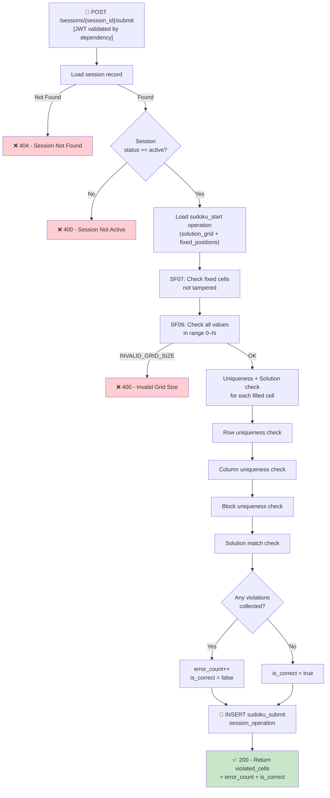

## 📝 Change History
| Date | Version | Changes | Status |
|------|---------|---------|--------|
| 2026-05-20 | 1.0.0 | Initial design | 📝 Draft |

# G02_F05_SF08: Validate Player Move

📝 MVP  
**Function**: Sudoku (G02_F05)  
**Status**: 📝 PLANNED  
**Priority**: High (Phase 2)  
**Difficulty**: Medium  

---

## 📋 Description

Validates the player's full submitted Sudoku grid when the player clicks the Submit button. This is the single server-side validation entry point — it is NOT called on every cell edit. The validation pipeline runs four checks in order: (1) fixed cells are not tampered (SF07), (2) all cell values are in the valid range 0–N (SF06), (3) row, column, and block uniqueness for every filled cell, and (4) each filled cell matches the authoritative `solution_grid`. The server loads `solution_grid` and `fixed_positions` from the original `sudoku_start` session operation, creates a `sudoku_submit` session operation recording the submitted grid and all violations found, and increments `error_count` when violations exist. Returns the list of violated cell positions and the updated `error_count`.

---

## 🎯 Detailed Requirements

### Input Parameters

**URL Parameter**
- `session_id`: UUID v4 — identifies the active Sudoku session

**Request Body (JSON)**
```json
{
  "current_grid": [
    [5, 3, 4, 6, 7, 8, 9, 1, 2],
    [6, 7, 2, 1, 9, 5, 3, 4, 8],
    [1, 9, 8, 3, 4, 2, 5, 6, 7],
    [8, 5, 9, 7, 6, 1, 4, 2, 3],
    [4, 2, 6, 8, 5, 3, 7, 9, 1],
    [7, 1, 3, 9, 2, 4, 8, 5, 6],
    [9, 6, 1, 5, 3, 7, 2, 8, 4],
    [2, 8, 7, 4, 1, 9, 6, 3, 5],
    [3, 4, 5, 2, 8, 6, 0, 7, 9]
  ]
}
```

**Headers**
```
Authorization: Bearer <access_token>
```

**Validation Rules**
- `session_id`: Required, UUID v4, must exist and belong to the authenticated user
- `current_grid`: Required, N×N 2-D array of integers
- Session must be in `active` state
- Grid dimensions must match `board_size` stored in the session

### Output Schemas

**Success Response — Violations Found (200 OK)**
```json
{
  "success": true,
  "data": {
    "violated_cells": [
      {"row": 8, "col": 6}
    ],
    "error_count": 3,
    "is_correct": false
  },
  "error": null
}
```

**Success Response — No Violations (200 OK)**
```json
{
  "success": true,
  "data": {
    "violated_cells": [],
    "error_count": 0,
    "is_correct": true
  },
  "error": null
}
```

**Note**: `is_correct` is `true` only when `violated_cells` is empty. A correct submission does not necessarily mean the puzzle is complete — empty cells (value 0) with no violations are allowed.

Error codes: `SESSION_NOT_FOUND` (404), `SESSION_NOT_ACTIVE` (400), `INVALID_GRID_SIZE` (400), `FIXED_CELL_MODIFIED` (400)

---

## 🗏️ Business Logic (7 Steps)

**Precondition**: User is authenticated — Bearer token validated via FastAPI `get_current_user_id()` dependency before this function executes.

1. **Load Session and Validate State** — Fetch the session record by `session_id`; verify it belongs to the authenticated user → Return 404 `SESSION_NOT_FOUND` if missing. Confirm `status == "active"` → Return 400 `SESSION_NOT_ACTIVE` if not. Read `board_size` from the session.

2. **Load Solution and Fixed Positions** — Query `session_operations` where `operation_type = "sudoku_start"` for the session. Parse `question_content.solution_grid` (the authoritative solved board) and `question_content.fixed_positions` (list of `{row, col, value}` objects).

3. **Run SF07 — Fixed Cell Integrity Check** — Call `_validate_fixed_cells(current_grid, fixed_positions)`. Collect any `{row, col}` entries returned into `violated_cells`.

4. **Run SF06 — Cell Value Range Check** — Call `_validate_cell_values(current_grid, board_size)`. If grid dimensions mismatch → Return 400 `INVALID_GRID_SIZE` immediately. Append any out-of-range `{row, col}` entries to `violated_cells`.

5. **Row, Column, and Block Uniqueness Check** — For each cell `(row, col)` where `current_grid[row][col] != 0`:
   - **Row check**: Value must not appear more than once in `current_grid[row][0..N-1]`.
   - **Column check**: Value must not appear more than once in `current_grid[0..N-1][col]`.
   - **Block check**: Value must not appear more than once in the `sqrt(N) × sqrt(N)` sub-grid that contains `(row, col)`.
   - **Solution match**: `current_grid[row][col]` must equal `solution_grid[row][col]`.
   - If any check fails → add `{"row": row, "col": col}` to `violated_cells` (avoid duplicates).

6. **Create Session Operation** — INSERT a new `session_operations` record:
   - `operation_type = "sudoku_submit"`
   - `question_content = {"current_grid": current_grid, "violated_cells": violated_cells}`
   - `is_correct = (len(violated_cells) == 0)`
   - `submitted_at = NOW()`
   - If `is_correct == False` → increment `error_count` on the session record.

7. **Return Result** — Return `violated_cells`, updated `error_count`, and `is_correct` to the caller.

---

## 🔄 Flow Diagram



---

## 💻 Backend Implementation

**Status**: 📝 PLANNED  
**Location**: `app/api/v1/games/sudoku.py`, `app/services/sudoku_service.py`  
**Tests**: Not yet written

### Architecture Overview

| Component | Purpose | Details |
|-----------|---------|---------|
| **Pydantic Schemas** | Input/output validation | `SudokuSubmitRequest` (current_grid), `SudokuSubmitResponse` (violated_cells, error_count, is_correct) |
| **Service Layer** | Business logic | `validate_sudoku_submission(session_id, current_grid, user_id)` orchestrates all 7 steps |
| **API Router** | HTTP endpoint | POST `/api/v1/games/sudoku/sessions/{session_id}/submit` returns 200 |
| **SF06 Helper** | Range validation | `_validate_cell_values(current_grid, board_size)` — pure function |
| **SF07 Helper** | Fixed cell check | `_validate_fixed_cells(current_grid, fixed_positions)` — pure function |
| **Database Models** | Data persistence | `session_operations` (sudoku_submit record), `game_sessions` (error_count update) |
| **Sudoku Generator** | Solution source | `solution_grid` and `fixed_positions` originally written by `app/utils/sudoku_generator.py` |

### Design Decision: Submit-Only Validation

Validation runs only on explicit submit, not on each cell change. This keeps the server stateless between submits, eliminates per-keystroke API calls, and places UI responsiveness entirely on the client. The client holds `current_grid` locally until the player hits Submit.

### Design Decision: `is_correct` Semantics

`is_correct = True` means the submitted grid has zero violations — all filled cells match the solution, respect row/column/block uniqueness, are in range, and no fixed cells are modified. It does NOT require the puzzle to be fully filled (empty cells with value 0 are allowed and not penalized).

### Implementation Highlights

⬜ **Session ownership check**: `session_id` must belong to the authenticated `user_id`  
⬜ **Load from sudoku_start**: Query `session_operations` by `session_id` and `operation_type = "sudoku_start"` to get `solution_grid` and `fixed_positions`  
⬜ **SF07 integration**: Call `_validate_fixed_cells`; merge tampered cells into `violated_cells`  
⬜ **SF06 integration**: Call `_validate_cell_values`; merge invalid-range cells; short-circuit on `INVALID_GRID_SIZE`  
⬜ **Uniqueness check**: For each filled cell check row, column, and `sqrt(N) × sqrt(N)` block against all other filled cells in the same group  
⬜ **Solution match**: Compare each filled cell against `solution_grid[row][col]`; mismatch adds to violations  
⬜ **Deduplication**: A cell appearing in multiple violation types is only added to `violated_cells` once  
⬜ **Persist sudoku_submit**: INSERT `session_operations` with `question_content = {current_grid, violated_cells}` and `is_correct`  
⬜ **error_count update**: Increment `game_sessions.error_count` atomically when `is_correct == False`  
⬜ **Async DB operations**: All queries use `async/await` with SQLAlchemy 2.0 async session  

### Future Enhancements

- Partial hint mode: Return a suggested correct value for one violated cell per submit
- Streak/scoring integration: Decrement score or streak for each error_count increment
- Completion detection: When puzzle is fully filled with no violations, auto-end the session

---

## 📊 Security Considerations

| Area | Implementation |
|------|----------------|
| **Session Ownership** | `session_id` verified against authenticated `user_id`; 404 if not owned |
| **Authoritative Solution** | `solution_grid` and `fixed_positions` always loaded from server DB — never from client payload |
| **Fixed Cell Immutability** | SF07 detects any fixed cell tampering regardless of client-side state |
| **Grid Size** | Server enforces N×N dimensions against stored `board_size`; oversized payloads rejected |
| **No Client Trust** | All validation is server-side; client state is treated as untrusted input |
| **Error Message Safety** | Violated cell coordinates returned; solution values never exposed in error responses |

---

## ✅ Test Coverage (Planned)

### Success Cases
- [ ] `test_sf08_no_violations` - Perfectly correct filled grid → empty violated_cells, is_correct=true
- [ ] `test_sf08_partial_fill_no_violations` - Partially filled grid, all filled cells correct → is_correct=true
- [ ] `test_sf08_empty_grid_submit` - All zeros grid → is_correct=true (no filled cells to violate)
- [ ] `test_sf08_error_count_increments` - Submit with violations → error_count increases by 1

### Violation Cases
- [ ] `test_sf08_fixed_cell_tampered` - Fixed cell changed → violated_cells contains that cell
- [ ] `test_sf08_cell_value_out_of_range` - Cell value > N → violated_cells contains that cell
- [ ] `test_sf08_invalid_grid_size` - Grid is (N-1)×N → 400 INVALID_GRID_SIZE
- [ ] `test_sf08_duplicate_in_row` - Same value twice in one row → both cells in violated_cells
- [ ] `test_sf08_duplicate_in_column` - Same value twice in one column → both cells in violated_cells
- [ ] `test_sf08_duplicate_in_block` - Same value twice in one block → both cells in violated_cells
- [ ] `test_sf08_wrong_value_vs_solution` - Filled cell differs from solution_grid → that cell in violated_cells
- [ ] `test_sf08_multiple_violation_types` - Multiple error types → all violating cells collected, no duplicates

### Authorization Cases
- [ ] `test_sf08_session_not_found` - Unknown session_id → 404 SESSION_NOT_FOUND
- [ ] `test_sf08_session_not_active` - Completed session → 400 SESSION_NOT_ACTIVE
- [ ] `test_sf08_session_wrong_user` - session_id belonging to different user → 404 SESSION_NOT_FOUND
- [ ] `test_sf08_unauthenticated` - Missing Bearer token → 401 UNAUTHORIZED

---

## 🚀 API Endpoint

**POST** `/api/v1/games/sudoku/sessions/{session_id}/submit`

**Request Headers**
```
Authorization: Bearer <access_token>
Content-Type: application/json
```

**Path Parameter**
- `session_id` (UUID) — active Sudoku session

**Request Body**
```json
{
  "current_grid": [
    [5, 3, 4, 6, 7, 8, 9, 1, 2],
    [6, 7, 2, 1, 9, 5, 3, 4, 8],
    [1, 9, 8, 3, 4, 2, 5, 6, 7],
    [8, 5, 9, 7, 6, 1, 4, 2, 3],
    [4, 2, 6, 8, 5, 3, 7, 9, 1],
    [7, 1, 3, 9, 2, 4, 8, 5, 6],
    [9, 6, 1, 5, 3, 7, 2, 8, 4],
    [2, 8, 7, 4, 1, 9, 6, 3, 5],
    [3, 4, 5, 2, 8, 6, 0, 7, 9]
  ]
}
```

**Response Examples**

Violations found (200)
```json
{
  "success": true,
  "data": {
    "violated_cells": [
      {"row": 8, "col": 6}
    ],
    "error_count": 1,
    "is_correct": false
  },
  "error": null
}
```

No violations (200)
```json
{
  "success": true,
  "data": {
    "violated_cells": [],
    "error_count": 0,
    "is_correct": true
  },
  "error": null
}
```

Session not found (404)
```json
{
  "success": false,
  "data": null,
  "error": {
    "code": "SESSION_NOT_FOUND",
    "message": "Session not found"
  }
}
```

Session not active (400)
```json
{
  "success": false,
  "data": null,
  "error": {
    "code": "SESSION_NOT_ACTIVE",
    "message": "Session is not active"
  }
}
```

Fixed cell modified (400)
```json
{
  "success": false,
  "data": null,
  "error": {
    "code": "FIXED_CELL_MODIFIED",
    "message": "One or more fixed cells have been modified"
  }
}
```

---

## 📋 Implementation Checklist

- [ ] `SudokuSubmitRequest` Pydantic schema: `current_grid` field
- [ ] `SudokuSubmitResponse` Pydantic schema: `violated_cells`, `error_count`, `is_correct`
- [ ] `validate_sudoku_submission(session_id, current_grid, user_id)` service method
- [ ] Session ownership and active status check
- [ ] Load `solution_grid` and `fixed_positions` from `sudoku_start` session operation
- [ ] SF07 integration: call `_validate_fixed_cells`
- [ ] SF06 integration: call `_validate_cell_values`; handle `INVALID_GRID_SIZE`
- [ ] Row uniqueness check for all filled cells
- [ ] Column uniqueness check for all filled cells
- [ ] Block uniqueness check for all filled cells
- [ ] Solution match check for all filled cells
- [ ] Deduplication of violated cells across checks
- [ ] INSERT `sudoku_submit` session operation with `question_content` and `is_correct`
- [ ] Atomic increment of `error_count` when `is_correct == False`
- [ ] POST route handler: `POST /api/v1/games/sudoku/sessions/{session_id}/submit`
- [ ] Route registered in `app/main.py`
- [ ] Full test suite covering all cases above

---

## 🔗 Related Documentation

- **Service Logic**: `app/services/sudoku_service.py`
- **Sudoku Generator**: `app/utils/sudoku_generator.py`
- **Database Models**: `app/models/session_operation.py`
- **Pydantic Schemas**: `app/schemas/sudoku.py`
- **API Router**: `app/api/v1/games/sudoku.py`
- **Test Suite**: `tests/test_sudoku.py`
- **Related Specs**: G02_F05_SF06 (Capture Single Number Input), G02_F05_SF07 (Replace Or Clear Cell Value), G02_F05_SF10

---

**Last Updated**: 2026-05-20  
**Implementation Status**: 📝 PLANNED  
**Test Status**: ⏳ NOT STARTED
