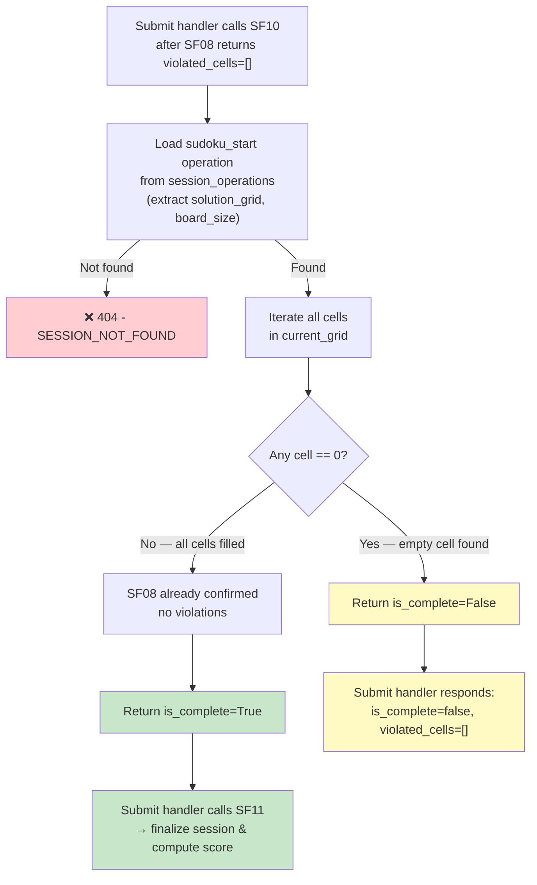

## 📝 Change History
| Date | Version | Changes | Status |
|------|---------|---------|--------|
| 2026-05-20 | 1.0.0 | Initial design draft | 📝 Draft |

# G02_F05_SF10: Check Puzzle Completion

📝 MVP  
**Function**: Sudoku (G02_F05)  
**Status**: 📝 DRAFT (Not yet implemented)  
**Priority**: High (Phase 2)  
**Difficulty**: Low  

---

## 📋 Description

Checks whether the player has fully completed the Sudoku puzzle after SF08 (grid validation) returns no violated cells. A puzzle is considered complete when two conditions are both true: (1) no cell in `current_grid` equals `0` (all cells are filled), AND (2) SF08 has already confirmed that all filled cells are correct against the solution. Because SF08 validates every filled cell before this function is called, SF10 only needs to detect remaining empty cells — there is no need to re-compare values against `solution_grid`. This function is not exposed as a standalone API endpoint; it is called internally by the submit handler immediately after SF08 returns an empty `violated_cells` list.

---

## 🎯 Detailed Requirements

### Input Parameters

**Function signature (internal call)**
```python
async def check_puzzle_completion(
    session_id: str,
    current_grid: list[list[int]],
    db: AsyncSession,
) -> bool:
```

| Parameter | Type | Description |
|-----------|------|-------------|
| `session_id` | `str` (UUID) | ID of the active GameSession |
| `current_grid` | `list[list[int]]` | N×N grid submitted by the player; `0` represents an empty cell |
| `db` | `AsyncSession` | Active async database session |

**Validation Rules**
- `current_grid` must be a square N×N matrix matching the `board_size` stored in the `sudoku_start` session_operation
- All cell values must be integers in the range `[0, N]` where `0` denotes an empty cell
- The session identified by `session_id` must exist and have `status="active"`

### Output Schemas

**Return value (internal)**
```python
bool  # True if puzzle is complete, False if empty cells remain
```

**Consumed by submit handler — partial response when is_complete=False (200 OK)**
```json
{
  "success": true,
  "data": {
    "is_complete": false,
    "violated_cells": []
  },
  "error": null
}
```

**Consumed by submit handler — triggers SF11 when is_complete=True**
```json
{
  "success": true,
  "data": {
    "is_complete": true,
    "violated_cells": [],
    "score": 571,
    "score_breakdown": {
      "base_score": 690,
      "time_penalty": 19,
      "error_penalty": 100,
      "final_score": 571
    },
    "duration_seconds": 384
  },
  "error": null
}
```

---

## 🗏️ Business Logic (4 Steps)

**Precondition**: SF08 has already been called and returned `violated_cells = []`. This function is only reached when the submitted grid passes all row/column/block constraint checks.

1. **Load solution_grid from session** — Query `session_operations` where `session_id = session_id` AND `operation_type = "sudoku_start"`; extract `question_content.solution_grid` and `question_content.board_size`. Raise `SESSION_NOT_FOUND (404)` if no matching record exists.

2. **Check for empty cells** — Iterate over every cell `(row, col)` in `current_grid`. If any cell value equals `0`, an empty cell has been found — the puzzle is not yet complete.

3. **Return is_complete=False if empty cells exist** — If at least one `0` was found in `current_grid`, return `False` immediately. The submit handler will respond with `is_complete=False` and `violated_cells=[]`.

4. **Return is_complete=True if all cells are filled** — If no `0` is found and SF08 confirmed no violations, all cells are correctly filled. Return `True`. The submit handler will then call SF11 to finalize the session and compute the score.

---

## 🔄 Flow Diagram



---

## 💻 Backend Implementation

**Status**: 📝 NOT YET IMPLEMENTED  
**Location**: `app/services/sudoku_service.py`, `app/api/v1/games/sudoku.py`  
**Tests**: `tests/test_sudoku.py`

### Architecture Overview

| Component | Purpose | Details |
|-----------|---------|---------|
| **Service Layer** | Core logic | `check_puzzle_completion(session_id, current_grid, db)` in `sudoku_service.py` |
| **Submit Handler** | Orchestration | Calls SF08 → SF10 → SF11 in sequence; SF10 is only reached when SF08 returns no violations |
| **Database Models** | Session state | Reads `session_operations` (operation_type=sudoku_start) to obtain board_size and solution_grid |
| **No Pydantic Schema** | Internal call | SF10 is a pure Python function; no dedicated request/response schema needed |

### Implementation Highlights

⬜ **Load sudoku_start operation**: Query `session_operations` by `session_id` and `operation_type="sudoku_start"`; extract `question_content`  
⬜ **Empty cell scan**: Single pass over all N×N cells; return `False` immediately on first `0` found  
⬜ **Early exit optimization**: Short-circuit on first empty cell to avoid unnecessary iteration  
⬜ **No re-validation of values**: Values are not compared against `solution_grid` — SF08 already confirmed correctness of all filled cells  
⬜ **Boolean return**: Returns `True` (complete) or `False` (incomplete); submit handler decides next action  
⬜ **Async DB operation**: Query executed via async SQLAlchemy session  
⬜ **Error handling**: `SESSION_NOT_FOUND (404)` if `sudoku_start` operation cannot be loaded  

### Future Enhancements

- Expose a lightweight polling endpoint (`GET /games/sudoku/{session_id}/status`) for clients that want to check completion state without submitting a full grid
- Support partial completion percentage (count filled cells / total hidden cells) for progress indicators

---

## 📊 Security Considerations

| Area | Implementation |
|------|----------------|
| **Authentication** | Called only from within the authenticated submit handler; no additional auth check needed |
| **Session Ownership** | Submit handler has already verified that the session belongs to the authenticated user before calling SF10 |
| **Solution Concealment** | `solution_grid` is loaded from `session_operations.question_content` (server-side only); it is never included in any client response |
| **Input Integrity** | `current_grid` is validated by SF08 before SF10 is reached; SF10 trusts the grid shape is correct |
| **No Client Override** | Completion state is computed purely from server-side data; the client cannot claim completion directly |

---

## ✅ Test Coverage

### Success Cases
- [ ] `test_sf10_returns_false_when_empty_cells_exist` - Grid with at least one `0` → returns `False`
- [ ] `test_sf10_returns_true_when_all_cells_filled` - Fully filled grid (no zeros) after SF08 passes → returns `True`
- [ ] `test_sf10_returns_false_for_partially_filled_grid` - Grid with multiple zeros → returns `False`
- [ ] `test_sf10_returns_true_triggers_sf11_in_submit_flow` - Submit handler calls SF11 when SF10 returns `True`
- [ ] `test_sf10_submit_response_contains_is_complete_false` - Submit endpoint returns `is_complete=false`, `violated_cells=[]` when incomplete

### Error Cases
- [ ] `test_sf10_session_not_found_returns_404` - Invalid or missing session_id → `SESSION_NOT_FOUND` 404

---

## 🚀 API Endpoint

SF10 has no standalone API endpoint. It is invoked internally by the Sudoku submit handler.

**Trigger path**: `POST /api/v1/games/sudoku/submit`

The submit handler orchestrates the full validation-completion-scoring pipeline:
```
POST /api/v1/games/sudoku/submit
  → SF08: validate grid → violated_cells
    if violated_cells not empty → return 200 with violated_cells
    if violated_cells empty
      → SF10: check_puzzle_completion → is_complete
        if is_complete=False → return 200 {is_complete: false, violated_cells: []}
        if is_complete=True
          → SF11: end_session_and_compute_score → score, score_breakdown
          → return 200 {is_complete: true, violated_cells: [], score, score_breakdown, duration_seconds}
```

**Response when is_complete=False (200 OK)**
```json
{
  "success": true,
  "data": {
    "is_complete": false,
    "violated_cells": []
  },
  "error": null
}
```

**Response when is_complete=True (200 OK)** — score data comes from SF11
```json
{
  "success": true,
  "data": {
    "is_complete": true,
    "violated_cells": [],
    "score": 571,
    "score_breakdown": {
      "base_score": 690,
      "time_penalty": 19,
      "error_penalty": 100,
      "final_score": 571
    },
    "duration_seconds": 384
  },
  "error": null
}
```

---

## 📋 Implementation Checklist

- [ ] Implement `check_puzzle_completion(session_id, current_grid, db)` in `app/services/sudoku_service.py`
- [ ] Load `sudoku_start` session_operation and extract `question_content` (board_size, solution_grid)
- [ ] Implement empty-cell scan loop with early exit on first `0`
- [ ] Return `True` if no empty cells found, `False` otherwise
- [ ] Raise `SESSION_NOT_FOUND (404)` HTTPException if `sudoku_start` operation does not exist
- [ ] Integrate SF10 call into submit handler in `app/api/v1/games/sudoku.py` after SF08 returns `violated_cells=[]`
- [ ] Ensure submit handler calls SF11 only when SF10 returns `True`
- [ ] Write tests in `tests/test_sudoku.py` covering all cases listed in Test Coverage

---

## 🔗 Related Documentation

- **Service Logic**: `app/services/sudoku_service.py`
- **API Router**: `app/api/v1/games/sudoku.py`
- **Database Models**: `app/models/game_session.py`, `app/models/session_operation.py`
- **Test Suite**: `tests/test_sudoku.py`
- **Related Specs**: G02_F05_SF08 (Validate Grid), G02_F05_SF11 (End Session & Compute Score)

---

**Last Updated**: 2026-05-20  
**Implementation Status**: 📝 DRAFT  
**Test Status**: 📝 NOT WRITTEN
