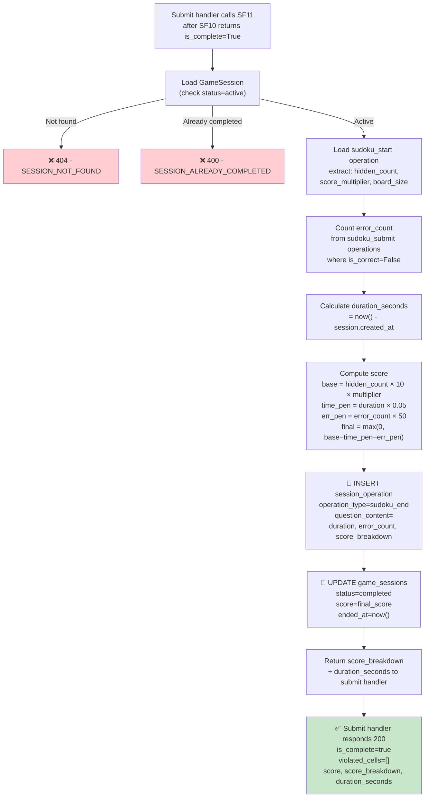

## 📝 Change History
| Date | Version | Changes | Status |
|------|---------|---------|--------|
| 2026-05-20 | 1.0.0 | Initial design draft | 📝 Draft |

# G02_F05_SF11: End Session and Compute Score

📝 MVP  
**Function**: Sudoku (G02_F05)  
**Status**: 📝 DRAFT (Not yet implemented)  
**Priority**: High (Phase 2)  
**Difficulty**: Medium  

---

## 📋 Description

Finalizes a Sudoku game session after SF10 confirms the puzzle is complete. SF11 calculates the player's final score using the board configuration, elapsed time, and error count. It then creates a `sudoku_end` session_operation that persists the full score breakdown, updates the `GameSession` record with `status="completed"`, `score`, and `ended_at`, and returns the score breakdown to the caller (the submit handler). This function is not exposed as a standalone API endpoint; it is called internally by the submit handler immediately after SF10 returns `is_complete=True`.

**Score formula:**
```python
POINTS_PER_HIDDEN_CELL = 10
TIME_PENALTY_RATE      = 0.05   # points deducted per second elapsed
ERROR_PENALTY_POINTS   = 50     # points deducted per wrong submission

base_score    = hidden_count * POINTS_PER_HIDDEN_CELL * score_multiplier
time_penalty  = duration_seconds * TIME_PENALTY_RATE
error_penalty = error_count * ERROR_PENALTY_POINTS
final_score   = max(0, int(base_score - time_penalty - error_penalty))
```

---

## 🎯 Detailed Requirements

### Input Parameters

**Function signature (internal call)**
```python
async def end_session_and_compute_score(
    session_id: str,
    db: AsyncSession,
) -> dict:
```

| Parameter | Type | Description |
|-----------|------|-------------|
| `session_id` | `str` (UUID) | ID of the active GameSession to finalize |
| `db` | `AsyncSession` | Active async database session |

**Validation Rules**
- The `GameSession` identified by `session_id` must exist; raise `SESSION_NOT_FOUND (404)` otherwise
- The session must have `status="active"`; raise `SESSION_ALREADY_COMPLETED (400)` if `status="completed"`
- A `sudoku_start` session_operation must exist for the session (guaranteed by the normal game flow)

### Output Schemas

**Return value (internal dict)**
```python
{
    "score": int,
    "score_breakdown": {
        "base_score": float,
        "time_penalty": float,
        "error_penalty": int,
        "final_score": int,
    },
    "duration_seconds": int,
}
```

**Final submit response to client (200 OK)** — composed by submit handler using SF11 output
```json
{
  "success": true,
  "data": {
    "is_complete": true,
    "violated_cells": [],
    "score": 571,
    "score_breakdown": {
      "base_score": 690,
      "time_penalty": 19,
      "error_penalty": 100,
      "final_score": 571
    },
    "duration_seconds": 384
  },
  "error": null
}
```

**Error Responses**
```json
{
  "success": false,
  "data": null,
  "error": {
    "code": "SESSION_NOT_FOUND",
    "message": "Game session not found"
  }
}
```

```json
{
  "success": false,
  "data": null,
  "error": {
    "code": "SESSION_ALREADY_COMPLETED",
    "message": "This session has already been completed"
  }
}
```

Error codes: `SESSION_NOT_FOUND` (404), `SESSION_ALREADY_COMPLETED` (400)

---

## 🗏️ Business Logic (7 Steps)

**Precondition**: SF10 has returned `is_complete=True`. The session is active and all cells in the submitted grid are correctly filled.

1. **Load sudoku_start operation** — Query `session_operations` where `session_id = session_id` AND `operation_type = "sudoku_start"`; extract `question_content` to obtain `hidden_count`, `score_multiplier`, and `board_size`. Also read `game_sessions.created_at` as the session start timestamp. Raise `SESSION_NOT_FOUND (404)` if the `GameSession` record does not exist. Raise `SESSION_ALREADY_COMPLETED (400)` if `game_sessions.status = "completed"`.

2. **Count error submissions** — Query `session_operations` where `session_id = session_id` AND `operation_type = "sudoku_submit"` AND `is_correct = False`. The total count is `error_count` (number of wrong submissions made during the session).

3. **Calculate duration** — Compute `duration_seconds = int((now() - game_session.created_at).total_seconds())`. Use `datetime.utcnow()` (or `datetime.now(UTC)`) as the end timestamp so timing is consistent with the database.

4. **Compute score components** — Apply the score formula:
   - `base_score = hidden_count * 10 * score_multiplier`
   - `time_penalty = round(duration_seconds * 0.05, 2)`
   - `error_penalty = error_count * 50`
   - `final_score = max(0, int(base_score - time_penalty - error_penalty))`

5. **Create sudoku_end session_operation** — INSERT into `session_operations` with:
   - `operation_type = "sudoku_end"`
   - `session_id = session_id`
   - `is_correct = True`
   - `question_content = { "duration_seconds": duration_seconds, "error_count": error_count, "score_breakdown": { "base_score": base_score, "time_penalty": time_penalty, "error_penalty": error_penalty, "final_score": final_score } }`
   - `question_correct_answer = null`, `user_answer = null`

6. **Update GameSession** — UPDATE `game_sessions` set `score = final_score`, `status = "completed"`, `ended_at = now()` where `id = session_id`.

7. **Return score breakdown** — Return a dict containing `score` (int), `score_breakdown` (dict with base_score, time_penalty, error_penalty, final_score), and `duration_seconds` (int) to the submit handler for inclusion in the API response.

---

## 🔄 Flow Diagram



---

## 💻 Backend Implementation

**Status**: 📝 NOT YET IMPLEMENTED  
**Location**: `app/services/sudoku_service.py`, `app/models/game_session.py`, `app/models/session_operation.py`, `app/schemas/sudoku.py`, `app/api/v1/games/sudoku.py`  
**Tests**: `tests/test_sudoku.py`

### Architecture Overview

| Component | Purpose | Details |
|-----------|---------|---------|
| **Service Layer** | Core logic | `end_session_and_compute_score(session_id, db)` in `sudoku_service.py` |
| **Submit Handler** | Orchestration | Calls SF08 → SF10 → SF11; merges SF11 output into the final submit response |
| **Pydantic Schemas** | Response validation | `SudokuSubmitResponse` in `app/schemas/sudoku.py` — includes `is_complete`, `violated_cells`, `score`, `score_breakdown`, `duration_seconds` |
| **Database Models** | Persistence | `game_sessions` (UPDATE status/score/ended_at), `session_operations` (INSERT sudoku_end) |
| **Score Constants** | Configurable | `POINTS_PER_HIDDEN_CELL=10`, `TIME_PENALTY_RATE=0.05`, `ERROR_PENALTY_POINTS=50` defined as module-level constants in `sudoku_service.py` |

### Implementation Highlights

⬜ **Session guard**: Load `GameSession`; raise `SESSION_NOT_FOUND (404)` if missing, `SESSION_ALREADY_COMPLETED (400)` if already done  
⬜ **sudoku_start operation loading**: Query `session_operations` for `operation_type="sudoku_start"` to obtain `hidden_count` and `score_multiplier`  
⬜ **Error count query**: Count `session_operations` rows with `operation_type="sudoku_submit"` and `is_correct=False`  
⬜ **Duration calculation**: `int((datetime.utcnow() - session.created_at).total_seconds())`  
⬜ **Score formula**: `base = hidden_count * 10 * score_multiplier`; `time_pen = duration * 0.05`; `err_pen = error_count * 50`; `final = max(0, int(base - time_pen - err_pen))`  
⬜ **Score constants**: Defined at module level (`POINTS_PER_HIDDEN_CELL`, `TIME_PENALTY_RATE`, `ERROR_PENALTY_POINTS`) for easy tuning  
⬜ **sudoku_end operation creation**: INSERT `session_operations` with `operation_type="sudoku_end"` and full `score_breakdown` JSON in `question_content`  
⬜ **GameSession update**: UPDATE `score`, `status="completed"`, `ended_at=now()` atomically within the same DB transaction  
⬜ **Async DB operations**: All queries executed via async SQLAlchemy session  
⬜ **Return dict**: Returns `{score, score_breakdown, duration_seconds}` to the submit handler  

### Future Enhancements

- Award XP or update `UserProfile.total_points` and `current_level` based on `final_score`
- Trigger badge evaluation after session completion (e.g., speed bonus badge, no-error badge)
- Persist leaderboard entry when `final_score` ranks in the top N for a given board size
- Emit a WebSocket event to notify real-time game room participants of session completion

---

## 📊 Security Considerations

| Area | Implementation |
|------|----------------|
| **Authentication** | Called only from within the authenticated submit handler; session ownership is verified before SF11 is reached |
| **Double-completion Guard** | `SESSION_ALREADY_COMPLETED (400)` prevents re-scoring an already-finished session (idempotency protection) |
| **Server-side Scoring** | All score components (hidden_count, score_multiplier, created_at, error_count) are loaded from server-side DB records; the client cannot supply or alter any scoring input |
| **Atomic DB Update** | The `sudoku_end` operation INSERT and `game_sessions` UPDATE are executed within the same DB transaction to prevent partial state |
| **No Score Tampering** | Score constants are defined server-side; clients have no influence over penalty rates or multipliers |
| **Audit Trail** | The `sudoku_end` session_operation stores the full score_breakdown JSON, enabling post-hoc verification of any score |

---

## ✅ Test Coverage

### Success Cases
- [ ] `test_sf11_returns_correct_score_breakdown` - Session with known hidden_count, multiplier, duration, errors → exact score values match formula
- [ ] `test_sf11_zero_error_penalty_when_no_errors` - No wrong submissions → `error_penalty=0` in score_breakdown
- [ ] `test_sf11_final_score_clamped_to_zero` - Excessive penalties → `final_score=0` (never negative)
- [ ] `test_sf11_creates_sudoku_end_operation` - DB contains `session_operation` with `operation_type="sudoku_end"` after call
- [ ] `test_sf11_updates_game_session_status_to_completed` - `game_sessions.status = "completed"` after call
- [ ] `test_sf11_updates_game_session_score` - `game_sessions.score` equals `final_score` after call
- [ ] `test_sf11_updates_game_session_ended_at` - `game_sessions.ended_at` is set to a recent timestamp after call
- [ ] `test_sf11_score_breakdown_stored_in_sudoku_end_operation` - `session_operations.question_content` contains `duration_seconds`, `error_count`, `score_breakdown`
- [ ] `test_submit_response_includes_score_when_complete` - Submit endpoint returns `is_complete=true` with `score`, `score_breakdown`, `duration_seconds`

### Error Cases
- [ ] `test_sf11_session_not_found_returns_404` - Invalid session_id → `SESSION_NOT_FOUND` 404
- [ ] `test_sf11_already_completed_returns_400` - Session with `status="completed"` → `SESSION_ALREADY_COMPLETED` 400

---

## 🚀 API Endpoint

SF11 has no standalone API endpoint. It is invoked internally by the Sudoku submit handler.

**Trigger path**: `POST /api/v1/games/sudoku/submit`

**Request Headers**
```
Authorization: Bearer <access_token>
Content-Type: application/json
```

**Request Body**
```json
{
  "session_id": "550e8400-e29b-41d4-a716-446655440000",
  "current_grid": [
    [5, 3, 4, 6, 7, 8, 9, 1, 2],
    [6, 7, 2, 1, 9, 5, 3, 4, 8],
    [1, 9, 8, 3, 4, 2, 5, 6, 7],
    [8, 5, 9, 7, 6, 1, 4, 2, 3],
    [4, 2, 6, 8, 5, 3, 7, 9, 1],
    [7, 1, 3, 9, 2, 4, 8, 5, 6],
    [9, 6, 1, 5, 3, 7, 2, 8, 4],
    [2, 8, 7, 4, 1, 9, 6, 3, 5],
    [3, 4, 5, 2, 8, 6, 1, 7, 9]
  ]
}
```

**Response Example — Puzzle Complete (200 OK)**
```json
{
  "success": true,
  "data": {
    "is_complete": true,
    "violated_cells": [],
    "score": 571,
    "score_breakdown": {
      "base_score": 690,
      "time_penalty": 19,
      "error_penalty": 100,
      "final_score": 571
    },
    "duration_seconds": 384
  },
  "error": null
}
```

**Response Example — Session Not Found (404)**
```json
{
  "success": false,
  "data": null,
  "error": {
    "code": "SESSION_NOT_FOUND",
    "message": "Game session not found"
  }
}
```

**Response Example — Session Already Completed (400)**
```json
{
  "success": false,
  "data": null,
  "error": {
    "code": "SESSION_ALREADY_COMPLETED",
    "message": "This session has already been completed"
  }
}
```

---

## 📋 Implementation Checklist

- [ ] Define score constants in `app/services/sudoku_service.py`: `POINTS_PER_HIDDEN_CELL=10`, `TIME_PENALTY_RATE=0.05`, `ERROR_PENALTY_POINTS=50`
- [ ] Implement `end_session_and_compute_score(session_id, db)` in `app/services/sudoku_service.py`
- [ ] Load `GameSession` by `session_id`; raise `SESSION_NOT_FOUND (404)` if missing
- [ ] Check `game_session.status != "completed"`; raise `SESSION_ALREADY_COMPLETED (400)` if already done
- [ ] Load `sudoku_start` session_operation; extract `hidden_count` and `score_multiplier` from `question_content`
- [ ] Query `session_operations` to count rows with `operation_type="sudoku_submit"` and `is_correct=False` → `error_count`
- [ ] Compute `duration_seconds = int((datetime.utcnow() - game_session.created_at).total_seconds())`
- [ ] Apply score formula: `base_score`, `time_penalty`, `error_penalty`, `final_score = max(0, int(...))`
- [ ] INSERT `session_operation` with `operation_type="sudoku_end"` and full `question_content` JSON
- [ ] UPDATE `game_sessions`: `score=final_score`, `status="completed"`, `ended_at=datetime.utcnow()`
- [ ] Return dict: `{score, score_breakdown, duration_seconds}` to the submit handler
- [ ] Update `SudokuSubmitResponse` Pydantic schema in `app/schemas/sudoku.py` to include `is_complete`, `violated_cells`, `score`, `score_breakdown`, `duration_seconds` (score fields optional, present only when `is_complete=True`)
- [ ] Integrate SF11 call into submit handler in `app/api/v1/games/sudoku.py` after SF10 returns `True`
- [ ] Ensure DB INSERT and UPDATE run in the same transaction (rollback on failure)
- [ ] Write tests in `tests/test_sudoku.py` covering all cases listed in Test Coverage

---

## 🔗 Related Documentation

- **Service Logic**: `app/services/sudoku_service.py`
- **Database Models**: `app/models/game_session.py`, `app/models/session_operation.py`
- **Pydantic Schemas**: `app/schemas/sudoku.py`
- **API Router**: `app/api/v1/games/sudoku.py`
- **Test Suite**: `tests/test_sudoku.py`
- **Related Specs**: G02_F05_SF08 (Validate Grid), G02_F05_SF10 (Check Puzzle Completion)

---

**Last Updated**: 2026-05-20  
**Implementation Status**: 📝 DRAFT  
**Test Status**: 📝 NOT WRITTEN
